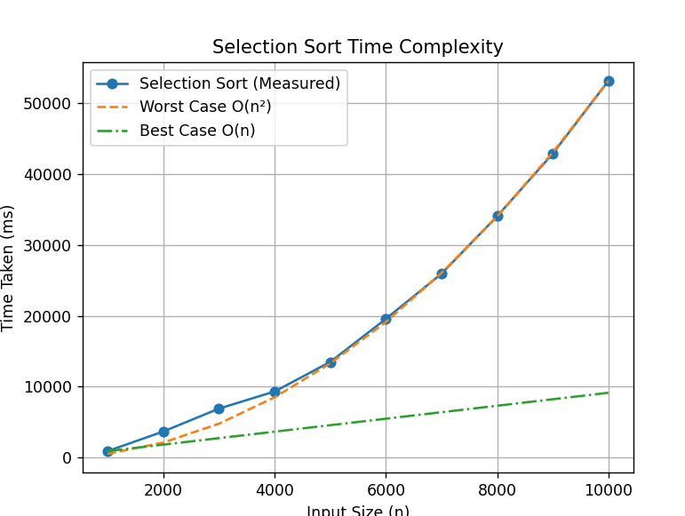
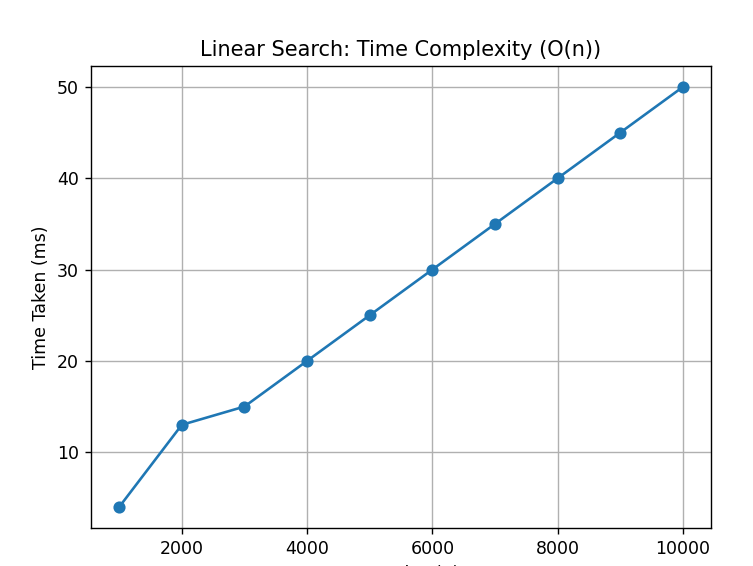

# Algorithms

## Practical-1: Power of a Number

### **Aim**
To implement and compare two methods to calculate the value of a number raised to the power **n** using recursion.

### **Theory**
This recursive method calculates the result by dividing the exponent into halves, which reduces the number of recursive calls.

### **Time Complexity**
- Recursive method: **O(log n)**

### **Space Complexity**
- Optimized recursive method: **O(log n)**

### **What the Code Does**
This program calculates the power of a number using two recursive approaches.

The **powerRec(x, n)** method uses divide and conquer.  
If the exponent is zero, it returns **1**.  
It recursively computes **x^(n/2)**.  
If the exponent is even, it multiplies the half result with itself.  
If the exponent is odd, it multiplies the result with **x** once more.

The **powerRec2(x, n)** method multiplies **x** with the result of **powerRec2(x, n − 1)** until the exponent becomes zero.

## Practical-2: Permutations of a String

### **Aim**
To generate all possible permutations of a given string using recursion.

### **Theory**
Permutation is the arrangement of characters of a string in all possible ways.  
For a string of length **n**, the total number of permutations is **n!**.

### **Time Complexity**
- **O(n × n!)**

### **Space Complexity**
- **O(n)**

### **What the Code Does**
This program generates all permutations of a string using recursion.

The **permute(s, index)** method fixes one character at a time.  
It swaps the current character with each character ahead.  
The function is then called recursively for the next index.  
When the index reaches the string length, the permutation is printed.  
Backtracking restores the original string after each recursive call.

## Practical-3: Tower of Hanoi

### **Aim**
To solve the Tower of Hanoi problem using recursion and display the sequence of moves.

### **Theory**
The Tower of Hanoi is a classic recursive problem where **n disks** are moved from a source rod to a destination rod using a helper rod.

The rules are:
- Only one disk can be moved at a time.
- A larger disk cannot be placed on a smaller disk.
- Only the top disk of a rod can be moved.

The problem is solved recursively by:
- Moving **n−1** disks to the helper rod.
- Moving the largest disk to the destination rod.
- Moving the **n−1** disks from the helper rod to the destination rod.

### **Time Complexity**
- **O(2ⁿ)**

### **Space Complexity**
- **O(n)** 

### **What the Code Does**
This program prints the steps required to move disks in the Tower of Hanoi problem.

The **towerOfHanoi(n, source, dest, helper)** function works as follows:  
If **n = 1**, it directly moves the disk from source to destination.  
Otherwise, it first moves **n − 1** disks from source to helper.  
Then it moves the nth disk from source to destination.  
Finally, it moves the **n − 1** disks from helper to destination.

## Practical-4: Generate Binary Strings

### **Aim**
To generate truth table for length **n** using recursion.

### **Theory**
A binary string consists of only **0** and **1**.  
For a string of length **n**, there are **2ⁿ** possible binary strings.

### **Time Complexity**
- **O(2ⁿ)**

### **Space Complexity**
- **O(n)** 

### **What the Code Does**
This program generates all binary strings of a given length.

The **generate(str, n)** function works recursively.  
If the length of the string becomes **n**, it prints the string and returns.  
Otherwise, it first adds **'0'** to the string and calls the function again.  
After backtracking, it adds **'1'** and repeats the process.

This ensures that all possible binary combinations are generated.

## Practical-5: Ball Jump Problem

### **Aim**
To calculate the number of jumps required for a ball’s bounce height to become less than 1 using recursion.

### **Theory**
In this problem, a ball is dropped from an initial height **v**.  
After each bounce, the height of the ball reduces by **42.5%** of its previous height.

The bouncing continues until the height becomes less than **1**.  
Recursion is used to repeatedly reduce the height and count the number of bounces.

### **Time Complexity**
- **O(logn)**  

### **Space Complexity**
- **O(logn)** 

### **What the Code Does**
This program calculates how many times a ball bounces before its height becomes less than 1.

The **jumps(v, t)** function works as follows:  
If the height **v** is greater than or equal to 1, the bounce count **t** is increased.  
The height is reduced by **42.5%** of its current value.  
The function then calls itself with the updated height and count.  
When **v** becomes less than 1, the function returns the total count.

## Practical-6: Recursive Selection Sort and Time Analysis

### **Aim**
To implement Selection Sort using recursion and analyze its average time complexity for different input sizes.

### **Theory**
Selection Sort is a comparison-based sorting algorithm.  
It works by repeatedly selecting the minimum element from the unsorted part of the array and placing it at the correct position.

### **Time Complexity**
- Best Case: **O(n²)**
- Average Case: **O(n²)**
- Worst Case: **O(n²)**

### **Space Complexity**
- **O(n)** 

### **What the Code Does**
This program sorts an array using recursive Selection Sort and measures its execution time.

The **minIndex(arr, i, n)** function finds the index of the minimum element in the unsorted portion of the array.  
The **swapIndex(arr, i, j)** function swaps two elements of the array.  

The **selectionSort(arr, i, n)** function recursively places the smallest element at index **i** and then calls itself for the remaining array.

The **getAverageTime(n)** function:
- Generates random arrays of size **n**
- Sorts them using Selection Sort
- Measures the execution time using high resolution clock
- Repeats this process 100 times and calculates the average time

## Practical-7: Recursive Bubble Sort and Time Analysis

### **Aim**
To implement Bubble Sort using recursion and analyze its average time complexity for different input sizes.

### **Theory**
Bubble Sort is a simple comparison-based sorting algorithm.  
It works by repeatedly swapping adjacent elements if they are in the wrong order.

### **Time Complexity**
- Best Case: **O(n)**  
- Average Case: **O(n²)**  
- Worst Case: **O(n²)**  

### **Space Complexity**
- **O(n)** 

### **What the Code Does**
This program sorts an array using recursive Bubble Sort and measures its execution time.

The **bubbleSortRecursive(arr, n)** function performs one pass of Bubble Sort to place the largest element at the end and then recursively sorts the remaining array of size **n − 1**.

The **getAverageTime(n)** function:
- Generates random arrays of size **n**
- Sorts them using recursive Bubble Sort
- Measures execution time using high resolution clock
- Repeats the process 100 times and calculates the average time

## Practical-8: Recursive Linear Search and Time Analysis

### **Aim**
To implement Linear Search using recursion and analyze its average execution time for different input sizes.

### **Theory**
Linear Search is a simple searching technique that checks each element of an array sequentially until the target element is found or the array ends.

### **Time Complexity**
- Best Case: **O(1)**
- Average Case: **O(n)**
- Worst Case: **O(n)**

### **Space Complexity**
- **O(n)** 

### **What the Code Does**
This program searches for an element in an array using recursive Linear Search and measures its execution time.

The **linearSearch(arr, n, target, index)** function checks whether the target element is present in the array.  
If the index reaches the array size, it returns false.  
If the target element is found, it returns true.  
Otherwise, the function calls itself for the next index.

The **getAverageTime(n)** function:
- Generates random arrays of size **n**
- Searches for a random target element
- Measures execution time using high resolution clock
- Repeats the process 100 times and calculates the average time

## Practical-9: Polynomial Evaluation Using Horner’s Rule

### **Aim**
To evaluate a polynomial for a given value of **x** using Horner’s Rule and recursion.

### **Theory**
Horner’s Rule is an efficient method for evaluating polynomials.  
It reduces the number of multiplications by rewriting the polynomial in a nested form.

For a polynomial of degree **n − 1**:
a₀xⁿ⁻¹ + a₁xⁿ⁻² + ... + aₙ₋₂x + aₙ₋₁

Horner’s form:
(...((a₀x + a₁)x + a₂)x + ... + aₙ₋₁)

This method can be implemented recursively.

### **Time Complexity**
- **O(n)**

### **Space Complexity**
- **O(n)** 

### **What the Code Does**
This program evaluates a polynomial using recursive Horner’s Rule.

The **horner(coeff, n, x)** function works as follows:  
If only one coefficient remains, it returns that coefficient.  
Otherwise, it multiplies the current coefficient with **x** and adds the result of the recursive call for the remaining coefficients.

The **main()** function defines the polynomial coefficients, the value of **x**, and prints the evaluated polynomial value.

## Practical-10: Find Duplicate Number Using XOR

### **Aim**
To find a duplicate number in an array using XOR-based index comparison.

### **Theory**
XOR can be used to detect duplicates by comparing each element with its index.  
For a correctly ordered array without duplicates, **nums[i] ^ i** will equal **0**.  
If a duplicate exists, the XOR will produce a non-zero value.

### **Time Complexity**
- **O(n)**

### **Space Complexity**
- **O(1)**

### **What the Code Does**
This program finds a duplicate number in an array using XOR and index comparison.

The **findDup(nums)** function iterates over the array:  
- If **nums[i] ^ i != 0**, it identifies **nums[i]** as a duplicate.  
- Otherwise, it continues checking all elements.  
- If no duplicate is found, it returns **-1**.
