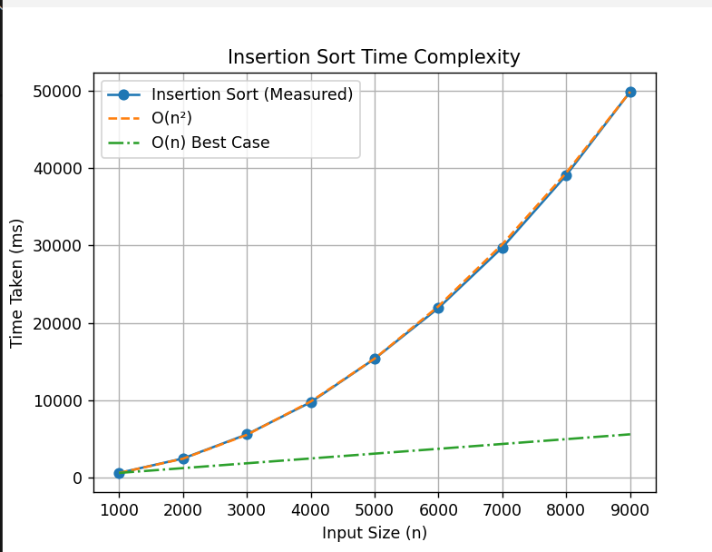

## Lab 2 

## Practical-1: Binary Search (Recursive) and Time Analysis
## Aim

To implement Binary Search using recursion and analyze its execution time for different input sizes.

## Theory

Binary Search is an efficient searching algorithm that works on a sorted array.
It follows the divide and conquer technique by repeatedly dividing the search interval into two halves.

The steps are:

Compare the target element with the middle element.

If equal, the element is found.

If the target is smaller, search the left sub-array.

If the target is larger, search the right sub-array.

Continue until the element is found or the search space becomes empty.

Binary Search is much faster than Linear Search for large datasets.

## Time Complexity

Best Case: O(1)

Average Case: O(log n)

Worst Case: O(log n)

## Space Complexity

O(log n) (recursive stack)

 ## What the Code Does

This program searches for an element in a sorted array using recursive Binary Search.

The binarySearch(arr, low, high, target) function works as follows:
If low > high, the element is not present.
It calculates the middle index of the array.
If the middle element matches the target, it returns true.
If the target is smaller, it recursively searches the left half.
If the target is larger, it recursively searches the right half.

The getAverageTime(n) function:

Generates sorted arrays of size n

Searches for a random target element

Measures execution time using high resolution clock

Repeats the experiment 100 times

Calculates the average execution time

## Practical-2: Insertion Sort
## Aim

To sort an array using Insertion Sort and analyze its time complexity.

## Theory

Insertion Sort is a simple comparison-based sorting algorithm.
It works by dividing the array into a sorted and an unsorted part.

At each iteration:

One element from the unsorted part is selected.

The element is placed at the correct position in the sorted part by shifting larger elements.

This process is repeated until the entire array is sorted.

## Time Complexity

Best Case: O(n)

Average Case: O(n²)

Worst Case: O(n²)

Space Complexity

Recursive method: O(n)

## What the Code Does

This program sorts an array using recursive Insertion Sort.

The insertionSort(arr, n) function works as follows:
It recursively sorts the first n − 1 elements of the array.
The nth element is then inserted into its correct position by shifting elements.
This process continues until the array becomes fully sorted.

