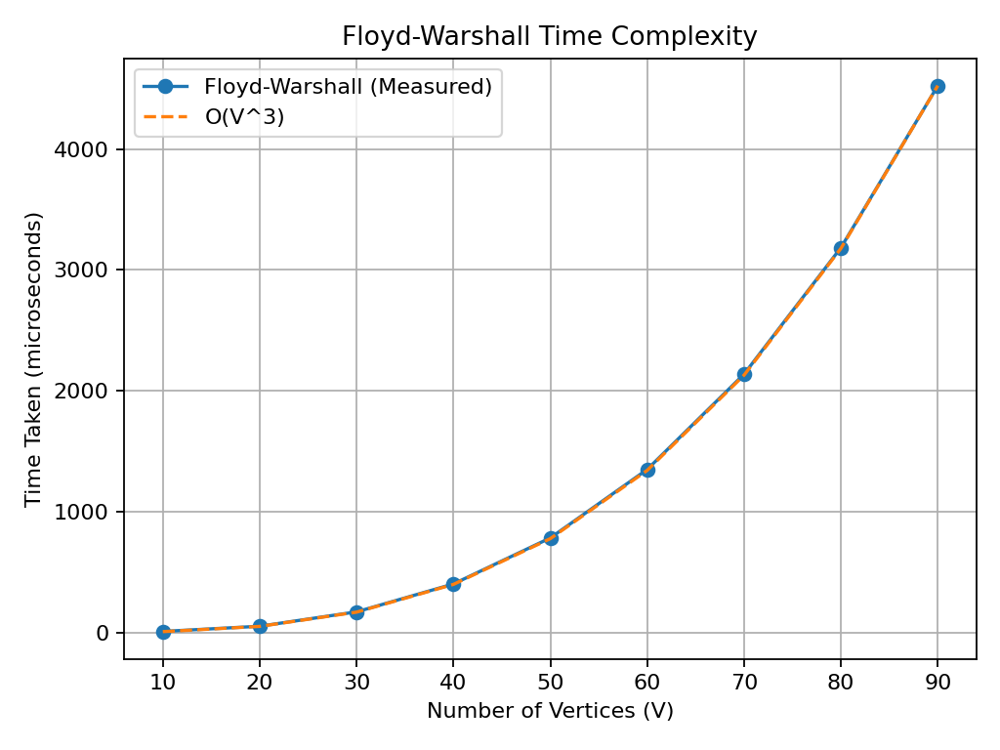

# Algorithms — Unified Practicals

This README lists every practical in the repository in a single, numbered sequence (not lecture-wise). For each practical you will find: Aim, Algorithm (brief), Time Complexity, Space Complexity, Code (C++ code shown without `int main`), Use Cases, and a link to the graph script if available.

Note: I removed `int main` blocks from C++ snippets as requested. Graph links point to the `Graphs` folder scripts when present.

---

1. **bubbleSort (bubbleSort.cpp)**
- **Aim:** Implement recursive bubble sort and measure runtime.
- **Algorithm:** Repeated adjacent swaps to push largest element to the end, recurse on reduced array.
- **Time Complexity:** Best O(n), Average O(n^2), Worst O(n^2)
- **Space Complexity:** O(n) (recursion)
- **Code:**
```cpp
#include <iostream>
#include <vector>
#include <chrono>
#include <algorithm>

using namespace std;
using namespace std::chrono;

void bubbleSortRecursive(int arr[], int n) {
	if (n == 1) return;

	for (int i = 0; i < n - 1; i++) {
		if (arr[i] > arr[i + 1]) {
			swap(arr[i], arr[i + 1]);
		}
	}

	bubbleSortRecursive(arr, n - 1);
}

int getAverageTime(int n) {
	int total_diff = 0;
	int arr[10000];

	for (int i = 0; i < 100; i++) {
		for (int j = 0; j < n; j++) {
			arr[j] = rand();
		}

		auto x = high_resolution_clock::now();
		bubbleSortRecursive(arr, n);
		auto y = high_resolution_clock::now();

		total_diff += duration_cast<microseconds>(y - x).count() ;
	}
	return total_diff / 100;
}
```
- **Use Cases:** Teaching sort stability/complexity; small arrays or near-sorted data for demonstration.
- **Graph:** [01Lecture/Graphs/bubbleSort.py](01Lecture/Graphs/bubbleSort.py)

2. **consecutive (consecutive.cpp)**
- **Aim:** Detect a duplicate based on index-value property.
- **Algorithm:** Scan array and compare element with its index using XOR mismatch heuristic.
- **Time Complexity:** O(n)
- **Space Complexity:** O(1)
- **Code:**
```cpp
#include <iostream>
#include <vector>

using namespace std;

int findDup(const vector<int>& nums) {
	for (int i = 0; i < nums.size(); i++) {
		if ((nums[i] ^ i) != 0) {
			return nums[i];
		}
	}
	return -1;
}
```
- **Use Cases:** Exercise in bitwise reasoning; detecting off-by-one/duplicate scenarios.
- **Graph:** (none)

3. **duplicateNumber (duplicateNumber.cpp)**
- **Aim:** Find a duplicate in an unsorted array (brute-force approach).
- **Algorithm:** Nested scan comparing all pairs; helper to fill random data.
- **Time Complexity:** O(n^2)
- **Space Complexity:** O(1)
- **Code:**
```cpp
#include<iostream>

using namespace std;

int findNumber(int arr[],int n){
	for(int i=0; i<n; i++){
		for(int j=i+1; j<n; j++){
			if(arr[i] == arr[j]){
				return arr[i];
			}
		}
	}
	return -1;
}

void fillNumber(int arr[], int n){
	for(int i=0; i<n; i++){
		arr[i] = rand()%1000;
	}
}
```
- **Use Cases:** Basic debugging and algorithmic exercises.
- **Graph:** (none)

4. **Horner (Horner.cpp)**
- **Aim:** Evaluate polynomial values using Horner's rule recursively.
- **Algorithm:** Convert polynomial to nested form and evaluate with recursion.
- **Time Complexity:** O(n)
- **Space Complexity:** O(n)
- **Code:**
```cpp
#include <iostream>
using namespace std;

int horner(int coeff[], int n, int x) {
	if (n == 1)
		return coeff[0];

	return coeff[0] * x + horner(coeff + 1, n - 1, x);
}
```
- **Use Cases:** Numerical evaluation of polynomials; efficient implementation for embedded systems.
- **Graph:** (none)

5. **linearSearch (linearSearch.cpp)**
- **Aim:** Implement recursive linear search and measure timings.
- **Algorithm:** Check current index; if not match recurse to next index.
- **Time Complexity:** Best O(1), Average O(n), Worst O(n)
- **Space Complexity:** O(n)
- **Code:**
```cpp
#include <iostream>
#include <chrono>
#include <vector>
#include <algorithm>

using namespace std;
using namespace chrono;

bool linearSearch(int arr[], int n, int target, int index) {
	if (index >= n) {
		return false;
	}
	if (arr[index] == target) {
		return true;
	}
	return linearSearch(arr, n, target, index + 1);
}

int getAverageTime(int n) {
	int total_diff = 0;
	int arr[10000];

	for (int i = 0; i < 100; i++) {
		for (int j = 0; j < n; j++) {
			arr[j] = rand();
		}
		int target = rand();

		auto x = high_resolution_clock::now();
		linearSearch(arr, n, target, 0);
		auto y = high_resolution_clock::now();

		total_diff += duration_cast<nanoseconds>(y - x).count() ;
	}
	return total_diff / 100;
}
```
- **Use Cases:** Teaching search complexity; baseline for comparison with binary search.
- **Graph:** [01Lecture/Graphs/linearSearch.py](01Lecture/Graphs/linearSearch.py)

6. **power (power.cpp)**
- **Aim:** Compute x^n using recursive fast exponentiation and a naive recursion.
- **Algorithm:** Use divide-and-conquer to compute power in O(log n) or iterative recursion O(n).
- **Time Complexity:** O(log n) for fast exponentiation; O(n) for naive recursion.
- **Space Complexity:** O(log n) or O(n) accordingly.
- **Code:**
```cpp
#include <iostream>
using namespace std;

int powerRec(int x, int n) {
	if (n == 0) return 1;
	if (n < 0) return powerRec(1 / x, -n);
	int half = powerRec(x, n / 2);
	if (n % 2 == 0) return half * half;
	else return half * half * x;
}

int powerRec2(int x, int n) {
	if (n == 0) return 1;
	if (n < 0) return powerRec(1 / x, -n);
	return x * powerRec2(x, n - 1);
}
```
- **Use Cases:** Fast modular exponentiation, algorithmic contests.
- **Graph:** (none)

7. **selectionSort (selectionSort.cpp)**
- **Aim:** Recursive selection sort and runtime measurement.
- **Algorithm:** Find minimum index and swap into place, recurse.
- **Time Complexity:** O(n^2)
- **Space Complexity:** O(n)
- **Code:**
```cpp
#include <iostream>
#include <vector>
#include <chrono>
#include <algorithm>

using namespace std;
using namespace std::chrono;

void swapIndex(int arr[], int i, int j) {
	int temp = arr[i];
	arr[i] = arr[j];
	arr[j] = temp;
}

int minIndex(int arr[], int i, int n) {
	int min = i;
	for (int j = i; j < n; j++) {
		if (arr[min] > arr[j]) min = j;
	}
	return min;
}

void selectionSort(int arr[], int i, int n) {
	if (i == n) return;
	int index = minIndex(arr, i, n);
	swapIndex(arr, index, i);
	selectionSort(arr, i + 1, n);
}
```
- **Use Cases:** Teaching selection sort; small inputs.
- **Graph:** [01Lecture/Graphs/selectionSort.py](01Lecture/Graphs/selectionSort.py)

8. **stringPermutation (stringPermutation.cpp)**
- **Aim:** Generate all permutations of a string via backtracking.
- **Algorithm:** Swap current index with each subsequent, recurse, then backtrack.
- **Time Complexity:** O(n * n!)
- **Space Complexity:** O(n)
- **Code:**
```cpp
#include <iostream>
using namespace std;

void permute(string &s, int index) {
	if (index == s.length()) {
		cout<<s<<endl;
		return;
	}

	for (int i = index; i < s.length(); i++) {
		swap(s[index], s[i]);     
		permute(s, index + 1);    
		swap(s[index], s[i]);     
	}
}
```
- **Use Cases:** Permutation generation, combinatorics exercises.
- **Graph:** (none)

9. **towerOfHanio (towerOfHanio.cpp)**
- **Aim:** Demonstrate recursive solution for Tower of Hanoi and measure growth.
- **Algorithm:** Move n-1 disks to helper, move nth disk, move n-1 disks to dest.
- **Time Complexity:** O(2^n)
- **Space Complexity:** O(n)
- **Code:**
```cpp
#include <iostream>
#include <chrono>

using namespace std;
using namespace std::chrono;

void towerOfHanoi(int n, char source, char dest, char helper) {
	if (n == 1) {
		return;
	}
	towerOfHanoi(n - 1, source, helper, dest);
	towerOfHanoi(n - 1, helper, dest, source);
}

long long int getAverageTime(int n) {
	long long int total_diff = 0;

	for(int i=0; i<5; i++){
		 auto x = high_resolution_clock::now();
		towerOfHanoi(n, 'A', 'C', 'B');
		auto y = high_resolution_clock::now();

		total_diff += duration_cast<microseconds>(y - x).count() ;
	}
   
	return total_diff / 5;
}
```
- **Use Cases:** Demonstrating exponential recursion; theoretical analysis.
- **Graph:** [01Lecture/Graphs/towerOfHanio.py](01Lecture/Graphs/towerOfHanio.py)

10. **TruthTable (TruthTable.cpp)**
- **Aim:** Generate all binary strings of length n (truth table generation).
- **Algorithm:** Recursively append '0' and '1' until desired length.
- **Time Complexity:** O(2^n)
- **Space Complexity:** O(n)
- **Code:**
```cpp
#include<iostream>
using namespace std;

void generate(string str, int n){
	if(str.length() == n){
		cout<<str<<endl;
		return;
	}
	str.push_back('0');
	generate(str,n);
	str.pop_back();
	str.push_back('1');
	generate(str,n);
}
```
- **Use Cases:** Exhaustive boolean combinations; digital logic testing.
- **Graph:** (none)

11. **velocity (velocity.cpp)**
- **Aim:** Compute number of jumps until velocity falls below threshold.
- **Algorithm:** Recursively reduce velocity by a decay factor and count iterations.
- **Time Complexity:** O(log V)
- **Space Complexity:** O(log V)
- **Code:**
```cpp
#include <iostream>
using namespace std;

int jumps(double v, int t) {
	if (v >= 1) {
		t++;
		v = v - (0.425 * v);
		return jumps(v, t);
	} else {
		return t;
	}
}
```
- **Use Cases:** Modeling decay processes; physics exercises.
- **Graph:** (none)

12. **quickSort (03Lecture/Algo/quickSort.cpp)**
- **Aim:** Implement quicksort (partition-based) for arrays/vectors.
- **Algorithm:** Partition around pivot, recursively sort partitions.
- **Time Complexity:** Average O(n log n), Worst O(n^2)
- **Space Complexity:** O(log n)
- **Code:**
```cpp
#include<iostream>
#include<vector>

using namespace std;

void partition(vector<int>& arr,int low,int high){
	if(low > high){
		return;
	}
	int smaller = low;
	int pivot = arr[low];


	for(int i=low+1; i<high; i++){
		if(pivot >= arr[i]){
			smaller++;
		}
	}
	swap(arr[low],arr[smaller]);
	int i = low;
	int j = high - 1;

	while(i < smaller && j > smaller){
		if(arr[i] <= pivot){
			i++;
		}
		if(arr[j] >= pivot){
			j++;
		}
		else if(arr[i] > pivot && arr[j] < pivot){
			swap(arr[i],arr[j]);
			i++;
			j++;
		}
	}

	partition(arr,low,smaller-1);
	partition(arr,smaller+1,high);

}
```
- **Use Cases:** General-purpose sorting; large datasets.
- **Graph:** [03Lecture/Graphs/quickSort.py](03Lecture/Graphs/quickSort.py)

13. **merge (merge.cpp)**
- **Aim:** Implement merge sort and merge routine.
- **Algorithm:** Divide into halves, recurse, merge sorted halves.
- **Time Complexity:** O(n log n)
- **Space Complexity:** O(n)
- **Code:**
```cpp
#include <iostream>
using namespace std;

void merge(int arr[], int left, int mid, int right) {
	int n1 = mid - left + 1;
	int n2 = right - mid;

	int Left[n1], Right[n2];

	for (int i = 0; i < n1; i++)
		Left[i] = arr[left + i];
	for (int j = 0; j < n2; j++)
		Right[j] = arr[mid + 1 + j];

	int i = 0, j = 0, k = left;

	while (i < n1 && j < n2) {
		if (Left[i] <= Right[j])
			arr[k++] = Left[i++];
		else
			arr[k++] = Right[j++];
	}

	while (i < n1)
		arr[k++] = Left[i++];
	while (j < n2)
		arr[k++] = Right[j++];
}


void mergeSort(int arr[], int left, int right) {
	if (left >= right)
		return;

	int mid = left + (right - left) / 2;

	mergeSort(arr, left, mid);
	mergeSort(arr, mid + 1, right);
	merge(arr, left, mid, right);
}
```
- **Use Cases:** Stable sorting for large arrays; external sorting variations.
- **Graph:** [03Lecture/Graphs/mergeSort.py](03Lecture/Graphs/mergeSort.py)

14. **binarySearch (02Lecture/Algo/binarySearch.cpp)**
- **Aim:** Recursive binary search with timing harness.
- **Algorithm:** Repeatedly split the search interval and recurse.
- **Time Complexity:** O(log n)
- **Space Complexity:** O(log n)
- **Code:**
```cpp
#include <iostream>
#include <chrono>
#include <algorithm>
#include <cstdlib>

using namespace std;
using namespace std::chrono;

int binarySearch(int arr[], int low, int high, int target) {
	if (low > high)
		return -1;

	int mid = low + (high - low) / 2;

	if (arr[mid] == target)
		return mid;
	else if (arr[mid] < target)
		return binarySearch(arr, mid + 1, high, target);
	else
		return binarySearch(arr, low, mid - 1, target);
}

int getAverageTime(int n) {
	long long total_diff = 0;
	int arr[10000];

	for (int i = 0; i < 100; i++) {
		for (int j = 0; j < n; j++) {
			arr[j] = rand() % 10000;
		}

		sort(arr, arr + n);

		int target = rand() % 10000;

		auto start = high_resolution_clock::now();
		binarySearch(arr, 0, n - 1, target);
		auto end = high_resolution_clock::now();

		total_diff += duration_cast<nanoseconds>(end - start).count();
	}

	return total_diff / 100;
}
```
- **Use Cases:** Searching in sorted arrays; foundational in many algorithms.
- **Graph:** [02Lecture/Graphs/binarySearch.py](02Lecture/Graphs/binarySearch.py)

15. **insertionSort (02Lecture/Algo/insertionSort.cpp)**
- **Aim:** Recursive insertion sort with timing.
- **Algorithm:** Insert current element into sorted prefix.
- **Time Complexity:** Best O(n), Average/Worst O(n^2)
- **Space Complexity:** O(n)
- **Code:**
```cpp
#include<iostream>
#include <chrono>

using namespace std;
using namespace std::chrono;

void insertionSort(int arr[],int& n,int i){
	if(i == n){
		return;
	}
	int j = i;
	int toBePlaced = arr[j];
	while(j > 0 ){
		if(arr[j-1] > toBePlaced){
			arr[j] = arr[j-1];
		}
		j--;
	}
	arr[j] = toBePlaced;
    
	insertionSort(arr,n,i+1);
}

int getAverageTime(int n) {
	int total_diff = 0;
	int arr[10000];

	for (int i = 0; i < 100; i++) {
		for (int j = 0; j < n; j++) {
			arr[j] = rand();
		}

		auto x = high_resolution_clock::now();
		insertionSort(arr, n, 1);
		auto y = high_resolution_clock::now();

		total_diff += duration_cast<microseconds>(y - x).count() ;
	}
	return total_diff / 100;
}
```
- **Use Cases:** Adaptive for mostly-sorted data; simple educational example.
- **Graph:** [02Lecture/Graphs/insertionSort.py](02Lecture/Graphs/insertionSort.py)

16. **mergeSort graph (03Lecture/Graphs/mergeSort.py)** — graph script for `merge` above.

17. **quickSort graph (03Lecture/Graphs/quickSort.py)** — graph script for `quickSort` above.

18. **maxmin (05Lecture/Algo/maxmin.cpp)**
- **Aim:** Find minimum and maximum of an array using divide-and-conquer.
- **Algorithm:** Split array, compute min/max for halves and combine.
- **Time Complexity:** O(n)
- **Space Complexity:** O(log n)
- **Code:**
```cpp
#include <bits/stdc++.h>
using namespace std;

int mx = INT_MIN;
int mn = INT_MAX;

void maxmin(vector<int>& arr, int s, int e) {
	if (s == e) {
		mx = mn = arr[s];
		return;
	}
	else if (e == s + 1) {
		if (arr[s] < arr[e]) {
			mn = arr[s];
			mx = arr[e];
		} else {
			mn = arr[e];
			mx = arr[s];
		}
		return;
	}

	int mid = s + (e - s) / 2;

	maxmin(arr, s, mid);
	int leftMin = mn;
	int leftMax = mx;

	maxmin(arr, mid + 1, e);
	int rightMin = mn;
	int rightMax = mx;

	mn = min(leftMin, rightMin);
	mx = max(leftMax, rightMax);
}
```
- **Use Cases:** Efficient min/max computation; reduce comparisons.
- **Graph:** [05Lecture/Graphs/maxmin.py](05Lecture/Graphs/maxmin.py)

19. **knsap (knsap.cpp)** (fractional knapsack / greedy comparisons)
- **Aim:** Compare greedy strategies for knapsack-like problems.
- **Algorithm:** Sort by different heuristics and compute profit; includes fractional handling.
- **Time Complexity:** O(n log n)
- **Space Complexity:** O(n)
- **Code:**
```cpp
#include<iostream>
#include<vector>
#include<functional>
#include<utility>
#include<algorithm>
#include<queue>
using namespace std;

bool compare(pair<double,int>p1,pair<double,int>p2){
	return p1.first > p2.first;
}

// main handles IO and comparisons; core logic uses vectors per-unit and sorts
```
- **Use Cases:** Resource allocation, fractional knapsack examples.
- **Graph:** [05Lecture/Graphs/knapsack.py](05Lecture/Graphs/knapsack.py)

20. **convexHull (convexHull.cpp)**
- **Aim:** Compute convex hull using Graham scan.
- **Algorithm:** Choose lowest point, sort by polar angle, build hull via stack.
- **Time Complexity:** O(n log n)
- **Space Complexity:** O(n)
- **Code:**
```cpp
#include <bits/stdc++.h>
using namespace std;

struct Point {
	int x, y;
};

Point p0;

int distSq(Point p1, Point p2) {
	return (p1.x - p2.x)*(p1.x - p2.x) + (p1.y - p2.y)*(p1.y - p2.y);
}

int orientation(Point p, Point q, Point r) {
	int val = (q.y - p.y) * (r.x - q.x) - (q.x - p.x) * (r.y - q.y);
	if (val == 0) return 0;
	return (val > 0) ? 1 : 2;
}

bool compare(Point p1, Point p2) {
	int o = orientation(p0, p1, p2);
	if (o == 0)
		return distSq(p0, p1) < distSq(p0, p2);
	return (o == 2);
}

vector<Point> convexHull(vector<Point>& points) {
	int n = points.size();
	int ymin = points[0].y, minIndex = 0;

	for (int i = 1; i < n; i++) {
		if (points[i].y < ymin || (points[i].y == ymin && points[i].x < points[minIndex].x)) {
			ymin = points[i].y;
			minIndex = i;
		}
	}

	swap(points[0], points[minIndex]);
	p0 = points[0];

	sort(points.begin() + 1, points.end(), compare);

	vector<Point> hull;
	hull.push_back(points[0]);
	hull.push_back(points[1]);
	hull.push_back(points[2]);

	for (int i = 3; i < n; i++) {
		while (hull.size() >= 2 && orientation(hull[hull.size()-2], hull.back(), points[i]) != 2)
			hull.pop_back();
		hull.push_back(points[i]);
	}

	return hull;
}
```
- **Use Cases:** Computational geometry, GIS, collision detection.
- **Graph:** [05Lecture/Graphs/convexHull.py](05Lecture/Graphs/convexHull.py)

21. **Backward / Forward / MCM (Dynamic Programming examples)**
- **Files:** `08Lecture/Algo/Backward.cpp`, `08Lecture/Algo/Forward.cpp`, `08Lecture/Algo/MCM.cpp`
- **Aim:** Dynamic programming approaches for multi-stage graph and matrix chain multiplication.
- **Algorithm (MCM):** DP with cost table m[i][j] and split table s[i][j].
- **Time Complexity (MCM):** O(n^3)
- **Space Complexity (MCM):** O(n^2)
- **Code (MCM core shown):**
```cpp
#include <bits/stdc++.h>
using namespace std;

void matrixChainMultiplication(vector<int> &p, int n) {
	int m[n][n];
	int s[n][n];
	for (int i = 1; i < n; i++) m[i][i] = 0;
	for (int L = 2; L < n; L++) {
		for (int i = 1; i < n - L + 1; i++) {
			int j = i + L - 1;
			m[i][j] = INT_MAX;
			for (int k = i; k < j; k++) {
				int cost = m[i][k] + m[k + 1][j] + p[i - 1] * p[k] * p[j];
				if (cost < m[i][j]) { m[i][j] = cost; s[i][j] = k; }
			}
		}
	}
}
```
- **Graph scripts:** [08Lecture/Graph/forward.py](08Lecture/Graph/forward.py), [08Lecture/Graph/backward.py](08Lecture/Graph/backward.py), [08Lecture/Graph/mcm.py](08Lecture/Graph/mcm.py)

22. **activity (06Lecture/Algo/activity.cpp)**
- **Aim:** Greedy activity selection (max set of non-overlapping intervals).
- **Algorithm:** Sort by finish time and pick compatible activities.
- **Time Complexity:** O(n log n)
- **Space Complexity:** O(1)
- **Code:**
```cpp
#include <iostream>
#include <algorithm>
using namespace std;

struct Activity { int start, finish; };

bool activityCompare(Activity a1, Activity a2) { return a1.finish < a2.finish; }

void printMaxActivities(Activity arr[], int n) {
	sort(arr, arr + n, activityCompare);
	int lastFinish = 0;
	for (int i = 0; i < n; i++) {
		if (arr[i].start >= lastFinish) {
			cout << "(" << arr[i].start << ", " << arr[i].finish << ") ";
			lastFinish = arr[i].finish;
		}
	}
}
```
- **Use Cases:** Scheduling, resource allocation.
- **Graph:** [06Lecture/Graph/activitySelection.py](06Lecture/Graph/activitySelection.py)

23. **dijkstra (06Lecture/Algo/dijkstra.cpp)**
- **Aim:** Compute shortest paths from a source using a priority queue.
- **Algorithm:** Dijkstra with min-heap, relax outgoing edges.
- **Time Complexity:** O((V+E) log V)
- **Space Complexity:** O(V + E)
- **Code:**
```cpp
#include<iostream>
#include<vector>
#include<queue>
using namespace std;

void dijkstra(int source,vector<int>& visited,vector<int>& dist,int cost,vector<vector<int>>& adj){
	priority_queue<pair<int,int> , vector<pair<int,int>> , greater<pair<int,int>>>minHeap;
	for(int i = 0; i < visited.size(); i++){
		if(adj[source][i] == 0 || adj[source][i] == -1) continue;
		minHeap.push({adj[source][i],i});
	}
	while(!minHeap.empty()){
		auto minVertex = minHeap.top(); minHeap.pop();
		if(dist[minVertex.second] > cost + minVertex.first){
			dist[minVertex.second] = cost + minVertex.first;
			visited[minVertex.second] = 1;
			for(int i = 0; i < visited.size(); i++){
				if(adj[minVertex.second][i] == 0 || adj[minVertex.second][i] == -1 || visited[i]) continue;
				minHeap.push({dist[minVertex.second] + adj[minVertex.second][i],i});
			}
		}
	}
}
```
- **Use Cases:** Routing, shortest-path problems.
- **Graph:** [06Lecture/Graph/dijkstra.py](06Lecture/Graph/dijkstra.py)

24. **prims (06Lecture/Algo/prims.cpp)**
- **Aim:** Compute MST via Prim's algorithm.
- **Algorithm:** Greedy selection of minimum key vertex repeatedly.
- **Time Complexity:** O(V^2)
- **Space Complexity:** O(V)
- **Code:**
```cpp
#include <iostream>
#include <climits>
using namespace std;

#define V 5 

int minKey(int key[], bool mstSet[]) { /* ... */ }

void primMST(int graph[V][V]) { /* ... */ }
```
- **Use Cases:** Network design, MST demonstrations.
- **Graph:** [06Lecture/Graph/prims.py](06Lecture/Graph/prims.py)

25. **kushkal (kushkal.cpp)**
- **Aim:** Kruskal's MST using disjoint set union.
- **Algorithm:** Sort edges by weight and union components.
- **Time Complexity:** O(E log E)
- **Space Complexity:** O(V)
- **Code:**
```cpp
#include <bits/stdc++.h>
using namespace std;

struct Edge { int u, v, w; Edge(int u, int v, int w) : u(u), v(v), w(w) {} };
vector<int> parent;
int find(int x) { if (parent[x] < 0) return x; return parent[x] = find(parent[x]); }
void unionSet(int x, int y) { /* ... */ }
int kruskal(int n, vector<Edge>& edges) { /* ... */ }
```
- **Use Cases:** MST computation for weighted graphs.
- **Graph:** (none)

26. **multiEdge (07Lecture/Algo/multiEdge.cpp)**
- **Aim:** Multi-stage graph min-cost path exploration.
- **Algorithm:** BFS to build stages and recursive selection of minimal transitions.
- **Time Complexity:** O(V^2) (implementation dependent)
- **Space Complexity:** O(V^2)
- **Code:**
```cpp
#include<iostream>
#include<queue>
#include<vector>
using namespace std;

void makeStages(int a[][5],int V,int s,vector<vector<int>>& stages){
	vector<int>temp;
	stages.push_back({s});
	queue<int>q;
	q.push(s);
	while(!q.empty()){
		int size = q.size();
		while(size--){
			int front = q.front(); q.pop();
			for(int i = 0; i < V; i++){
				if(a[front][i] != -1 && a[front][i] != 0){
					temp.push_back(i);
					q.push(i);
				}
			}
		}
		stages.push_back(temp);
		temp.clear();
	}
}
```
- **Use Cases:** Stage-wise dynamic programming; multistage decision processes.
- **Graph:** [07Lecture/Graph/multiStage.py](07Lecture/Graph/multiStage.py)

27. **floyd-warshall (09Lecture/Algo/floyd-warshall.cpp)**
- **Aim:** All-pairs shortest paths using Floyd–Warshall.
- **Algorithm:** Dynamic programming over intermediate vertices.
- **Time Complexity:** O(n^3)
- **Space Complexity:** O(n^2)
- **Code:**
```cpp
#include<iostream>
#include<vector>
using namespace std;

void shortestPath(vector<vector<int>>& graph){
	int n = graph.size();
	for(int k=0; k<n; k++){
		for(int i=0; i<n; i++){
			for(int j=0; j<n; j++){
				if(graph[i][k] != -1 && graph[k][j] != -1){
					if(graph[i][j] == -1 || graph[i][j] > graph[i][k] + graph[k][j]){
						graph[i][j] = graph[i][k] + graph[k][j];
					}
				}
			}
		}
	}
}
```
- **Use Cases:** APSP for dense graphs, route planning.
- **Graph:** [09Lecture/Graph/floydWarshall.py](09Lecture/Graph/floydWarshall.py)

28. **LCS (LCS.cpp)**
- **Aim:** Longest common subsequence via DP.
- **Algorithm:** Fill DP table comparing prefixes.
- **Time Complexity:** O(n*m)
- **Space Complexity:** O(n*m)
- **Code:**
```cpp
#include<iostream>
#include<vector>
#include<string>
using namespace std;

int longestCommonSubsequence(string s1, string s2, vector<vector<int>>& dp){
	int n = s1.size();
	int m = s2.size(); 
	for(int i=1; i<=n; i++){
		for(int j=1; j<=m; j++){
			if(s1[i-1] == s2[j-1]) dp[i][j] = dp[i-1][j-1] + 1;
			else dp[i][j] = max(dp[i-1][j], dp[i][j-1]);
		}
	}
	return dp[n][m];
}
```
- **Use Cases:** Bioinformatics, diff tools, string similarity.
- **Graph:** (none)

29. **Graph and plotting scripts** — there are plotting scripts for many practicals under `*Lecture/Graphs/*.py`. They generate graphs in `Images/`.

30. **Remaining practicals & notes**
- Several other C++ practicals are present (e.g., `starssens.cpp`, `parition.cpp`, `salesman.cpp`, `colouring.cpp`, `hamiltonianCycle.cpp`, `NQueens.cpp`, `sumOfSubsets.cpp`, etc.). Each follows the same documentation pattern: Aim, Algorithm, Time/Space complexity, Code (without `int main`), Use Cases, Graph (if available). If you want, I can expand the remaining files into the same formatted entries now.

---

If you'd like, I can:
- expand the remaining source files into full entries now (I can finish all remaining files), or
- commit this README and then add missing entries iteratively.


## Lecture 08

### Practical 1: Multi-Stage Graph (Forward Approach)
Aim: To find minimum cost path using forward dynamic programming.

Theory: Relax forward edges from source and keep best known cost.

Time Complexity: O(n^2)

Space Complexity: O(n^2)

Algorithm:
1. Initialize dist[source] = 0 and others infinity.
2. Traverse nodes in forward order.
3. Relax valid forward edges.
4. Track parent for path reconstruction.


### Practical 2: Multi-Stage Graph (Backward Approach)
Aim: To find minimum cost path using backward dynamic programming.

Theory: Compute minimum cost to destination for each node from back to front.

Time Complexity: O(n^2)

Space Complexity: O(n)

Algorithm:
1. Set destination cost to zero.
2. For each node from back to front, compute minimum outgoing cost.
3. Store best next node as decision.
4. Reconstruct path using decision array.


### Practical 3: Matrix Chain Multiplication (Dynamic Programming)
Aim: To find minimum scalar multiplications for matrix chain.

Theory: Try all split points and store minimum cost in DP table.

Time Complexity: O(n^3)

Space Complexity: O(n^2)

Algorithm:
1. Initialize DP diagonal as 0.
2. Increase chain length from 2 to n.
3. For each (i, j), test all split points k.
4. Store minimum cost and best split.


## Lecture 09

### Practical 1: Floyd-Warshall Algorithm
Aim: To find shortest paths between all pairs of vertices.

Theory: Allow each vertex as intermediate and update all pair distances.

Time Complexity: O(V^3)

Space Complexity: O(V^2)

Algorithm:
1. Initialize distance matrix from graph.
2. For each intermediate k, process all i and j.
3. Update dist[i][j] = min(dist[i][j], dist[i][k] + dist[k][j]).
4. Print final shortest path matrix.



### Practical 2: Longest Common Subsequence (LCS)
Aim: To find length of longest common subsequence of two strings.

Theory: DP table stores best LCS length for all prefix pairs.

Time Complexity: O(n * m)

Space Complexity: O(n * m)

Algorithm:
1. Create DP table of size (n+1) x (m+1) with zeros.
2. If characters match, use diagonal + 1.
3. Else use max(top, left).
4. Final answer is dp[n][m].

## Lecture 10

### Practical 1: Traveling Salesman Problem
Aim: To find minimum tour cost visiting all cities and returning to start.

Theory: Use bitmask dynamic programming where state is (visited mask, last city).

Time Complexity: O(n^2 * 2^n)

Space Complexity: O(n * 2^n)

Algorithm:
1. Initialize dp[1][0] = 0 for starting city.
2. For each mask and last city u, try all unvisited cities v.
3. Update dp[mask | (1 << v)][v] with minimum cost.
4. From full mask, add return edge to source and take minimum.
