## **1. Power of a Number**

### Aim
Implement fast exponentiation using divide-and-conquer vs naive recursion. Compare O(log n) vs O(n) complexity.

### Algorithm
1. Base case: If n = 0, return 1
2. Compute half = power(x, n/2)
3. If n is even: return half × half
4. If n is odd: return half × half × x

### Time Complexity
- Fast: O(log n) | Naive: O(n)

### Space Complexity
- O(log n) recursion depth

### Code
```cpp
using namespace std;

int powerRec(int x, int n) {
    if (n == 0) return 1;
    int half = powerRec(x, n / 2);
    if (n % 2 == 0) return half * half;
    else return half * half * x;
}

int powerRec2(int x, int n) {
    if (n == 0) return 1;
    return x * powerRec2(x, n - 1);
}
```

### Use Cases
- Cryptography (modular exponentiation)
- Game development (damage calculations)
- Scientific computing

---

## **2. String Permutations**

### Aim
Generate all permutations of a string using backtracking.

### Algorithm
1. For each position, swap with remaining characters
2. Recursively permute the rest
3. Backtrack to explore alternatives

### Time Complexity
- O(n × n!)

### Space Complexity
- O(n)

### Code
```cpp
using namespace std;

void permute(string &s, int index) {
    if (index == (int)s.length()) {
        cout << s << "\n";
        return;
    }
    for (int i = index; i < (int)s.length(); ++i) {
        swap(s[index], s[i]);
        permute(s, index + 1);
        swap(s[index], s[i]);
    }
}
```

### Use Cases
- Anagram solving
- Test case generation
- Combinatorial optimization

---

## **3. Tower of Hanoi**

### Aim
Solve Tower of Hanoi puzzle using recursion. Demonstrate exponential growth (2^n moves).

### Algorithm
1. Move n-1 disks from source to helper
2. Move largest disk from source to destination
3. Move n-1 disks from helper to destination

### Time Complexity
- O(2^n)

### Space Complexity
- O(n)

### Code
```cpp
using namespace std;

void towerOfHanoi(int n, char src, char dst, char hlp) {
    if (n == 1) {
        cout << "Move disk from " << src << " to " << dst << "\n";
        return;
    }
    towerOfHanoi(n - 1, src, hlp, dst);
    cout << "Move disk from " << src << " to " << dst << "\n";
    towerOfHanoi(n - 1, hlp, dst, src);
}
```

### Use Cases
- Algorithm education
- Recursion teaching
- Complexity analysis

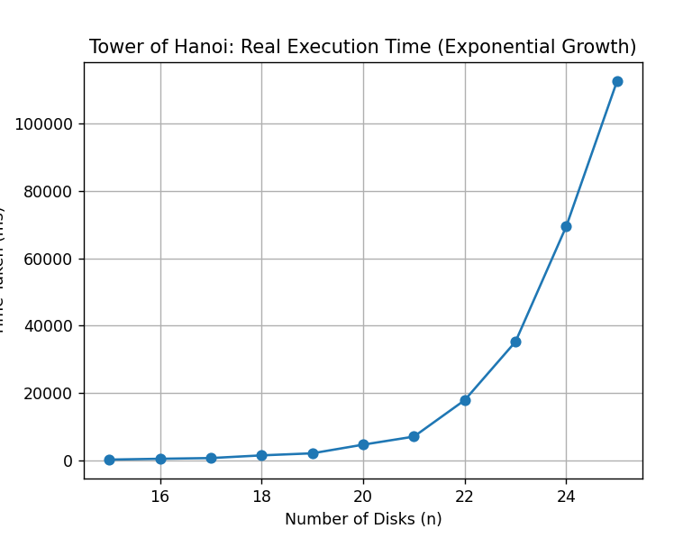

---

## **4. Generate Truth Table (Binary Strings)**

### Aim
Generate all 2^n binary strings of length n using backtracking.

### Algorithm
1. If string length equals n, print and return
2. Append '0', recurse, backtrack
3. Append '1', recurse, backtrack

### Time Complexity
- O(2^n)

### Space Complexity
- O(n)

### Code
```cpp
using namespace std;

void generate(string s, int n) {
    if ((int)s.length() == n) {
        cout << s << "\n";
        return;
    }
    s.push_back('0');
    generate(s, n);
    s.pop_back();
    s.push_back('1');
    generate(s, n);
    s.pop_back();
}
```

### Use Cases
- Digital logic truth tables
- Test suite generation
- Binary counting

---

## **5. Linear Search**

### Aim
Recursive linear search on unsorted arrays. Baseline for search algorithm comparison.

### Algorithm
1. If index >= n, return false
2. If arr[index] == target, return true
3. Recurse with index+1

### Time Complexity
- O(1) best | O(n) average/worst

### Space Complexity
- O(n) recursion depth

### Code
```cpp
using namespace std;

bool linearSearch(int arr[], int n, int target, int index) {
    if (index >= n) return false;
    if (arr[index] == target) return true;
    return linearSearch(arr, n, target, index + 1);
}
```

### Use Cases
- Linked list searching
- Real-time systems
- Unstructured data search

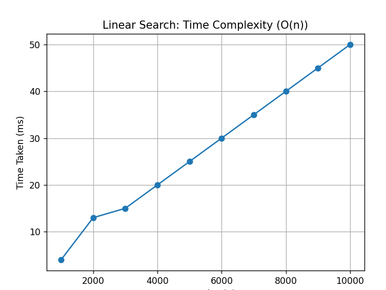

---

## **6. Bubble Sort**

### Aim
Recursive bubble sort. Simple teaching algorithm for sorting fundamentals.

### Algorithm
1. If array length = 1, return
2. Pass through array, swap adjacent elements
3. Recursively sort first n-1 elements

### Time Complexity
- O(n) best | O(n²) average/worst

### Space Complexity
- O(n)

### Code
```cpp
using namespace std;

void bubbleSortRecursive(int arr[], int n) {
    if (n == 1) return;
    for (int i = 0; i < n - 1; i++) {
        if (arr[i] > arr[i + 1]) 
            swap(arr[i], arr[i + 1]);
    }
    bubbleSortRecursive(arr, n - 1);
}
```

### Use Cases
- Algorithm education
- Nearly-sorted data
- Small dataset sorting

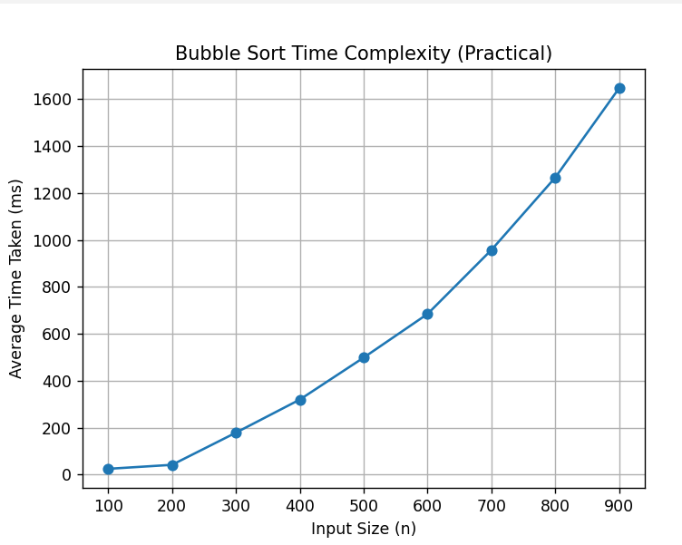

---

## **7. Selection Sort**

### Aim
Recursive selection sort. Minimal swaps, constant O(n²) performance.

### Algorithm
1. Find minimum from current position to end
2. Swap with current position
3. Recursively sort remaining elements

### Time Complexity
- O(n²) all cases

### Space Complexity
- O(n)

### Code
```cpp
using namespace std;

int minIndex(int arr[], int i, int n) {
    int mn = i;
    for (int j = i; j < n; j++) {
        if (arr[j] < arr[mn]) mn = j;
    }
    return mn;
}

void selectionSort(int arr[], int i, int n) {
    if (i == n) return;
    int idx = minIndex(arr, i, n);
    swap(arr[i], arr[idx]);
    selectionSort(arr, i + 1, n);
}
```

### Use Cases
- Write-sensitive storage (EEPROM, flash)
- Predictable swap count
- Small/medium datasets

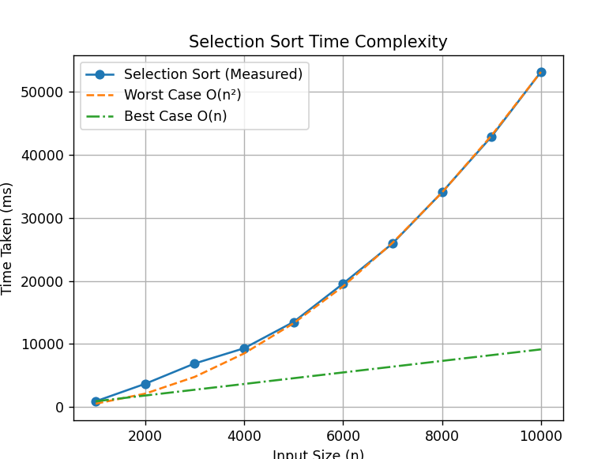

---

## **8. Horner's Method for Polynomial Evaluation**

### Aim
Efficiently evaluate polynomials using nested multiplication. Reduces operations from 2n to n.

### Algorithm
1. If one coefficient remains, return it
2. Return coeff[0] × x + horner(coeff+1, n-1, x)

### Time Complexity
- O(n)

### Space Complexity
- O(n)

### Code
```cpp
using namespace std;

int horner(int coeff[], int n, int x) {
    if (n == 1) return coeff[0];
    return coeff[0] * x + horner(coeff + 1, n - 1, x);
}

int hornerIterative(int coeff[], int n, int x) {
    int result = coeff[n - 1];
    for (int i = n - 2; i >= 0; i--) {
        result = result * x + coeff[i];
    }
    return result;
}
```

### Use Cases
- Numerical analysis
- Signal processing
- Graphics rendering

---

## **9. Find Duplicate Number**

### Aim
Find duplicate elements in array using brute force approach.

### Algorithm
1. For each element i, compare with all j > i
2. If match found, return duplicate
3. If none found, return -1

### Time Complexity
- O(n²)

### Space Complexity
- O(1)

### Code
```cpp
int findNumber(int arr[], int n) {
    for (int i = 0; i < n; ++i) {
        for (int j = i + 1; j < n; ++j) {
            if (arr[i] == arr[j]) return arr[i];
        }
    }
    return -1;
}
```

### Use Cases
- Data validation
- Integrity checking
- Small array processing

---

## **10. Consecutive Numbers Index-Value Relation**

### Aim
Detect anomalies using index/value XOR relationship.

### Algorithm
1. For each index i, compute value XOR index
2. If result ≠ 0, pattern violated
3. Return anomaly value

### Time Complexity
- O(n)

### Space Complexity
- O(1)

### Code
```cpp
using namespace std;

int findDup(const vector<int>& nums) {
    for (int i = 0; i < (int)nums.size(); ++i) {
        if ((nums[i] ^ i) != 0) return nums[i];
    }
    return -1;
}
```

### Use Cases
- Pattern validation
- Anomaly detection
- Hardware verification

---

## **11. Velocity/Ball Bounce Calculation**

### Aim
Calculate bounce count before height decays below threshold (exponential decay model).

### Algorithm
1. If v < 1, return count
2. Increment count, reduce height by 42.5%
3. Recurse with updated height

### Time Complexity
- O(log V)

### Space Complexity
- O(log V)

### Code
```cpp
using namespace std;

int jumps(double v, int t) {
    if (v < 1) return t;
    t++;
    v -= 0.425 * v;
    return jumps(v, t);
}

int jumpsIterative(double v) {
    int count = 0;
    while (v >= 1) {
        count++;
        v *= 0.575;
    }
    return count;
}
```

### Use Cases
- Physics simulations
- Decay process modeling
- Convergence prediction

---


## **12. Binary Search**

### Aim
Efficient binary search on sorted arrays. O(log n) complexity vs O(n) linear search.

### Algorithm
1. Compute mid = (low + high) / 2
2. If arr[mid] == target, return mid
3. If target < mid, search left half
4. If target > mid, search right half

### Time Complexity
- O(log n)

### Space Complexity
- O(log n) recursive | O(1) iterative

### Code
```cpp
using namespace std;

int binarySearch(int arr[], int low, int high, int target) {
    if (low > high) return -1;
    int mid = low + (high - low) / 2;
    if (arr[mid] == target) return mid;
    if (arr[mid] < target)
        return binarySearch(arr, mid + 1, high, target);
    else
        return binarySearch(arr, low, mid - 1, target);
}
```

### Use Cases
- Database indexing
- Library functions (std::binary_search)
- Real-time systems

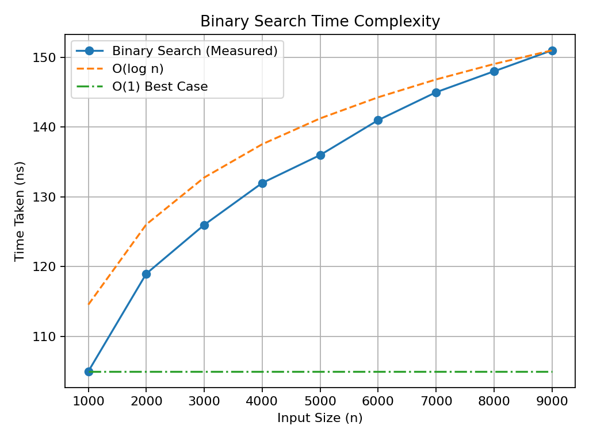

---

## **13. Insertion Sort**

### Aim
Build sorted array incrementally by inserting elements. Superior for nearly-sorted data.

### Algorithm
1. If array size ≤ 1, return
2. Sort first n-1 elements
3. Insert nth element into correct position

### Time Complexity
- O(n) best | O(n²) average/worst

### Space Complexity
- O(n) recursive | O(1) iterative

### Code
```cpp
using namespace std;

void insertionSort(int arr[], int n) {
    if (n <= 1) return;
    insertionSort(arr, n - 1);
    int last = arr[n - 1];
    int j = n - 2;
    while (j >= 0 && arr[j] > last) {
        arr[j + 1] = arr[j];
        j--;
    }
    arr[j + 1] = last;
}
```

### Use Cases
- Nearly-sorted data
- Online sorting
- Timsort/Introsort subroutine

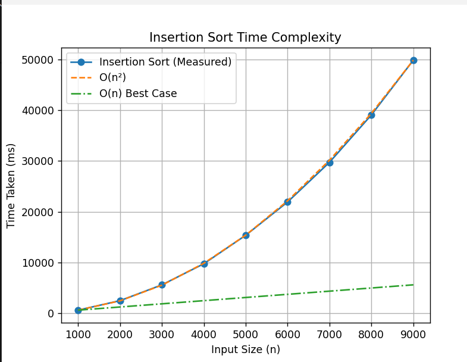

---

## **14. Merge Sort**

### Aim
Stable O(n log n) guaranteed sorting. Divide-and-conquer exemplified through merging.

### Algorithm
1. Split array into two halves
2. Recursively sort each half
3. Merge sorted halves

### Time Complexity
- O(n log n) all cases

### Space Complexity
- O(n) auxiliary space

### Code
```cpp
using namespace std;

void merge(int arr[], int left, int mid, int right) {
    int n1 = mid - left + 1;
    int n2 = right - mid;
    int L[n1], R[n2];
    for (int i = 0; i < n1; i++)
        L[i] = arr[left + i];
    for (int j = 0; j < n2; j++)
        R[j] = arr[mid + 1 + j];
    int i = 0, j = 0, k = left;
    while (i < n1 && j < n2) {
        if (L[i] <= R[j]) arr[k++] = L[i++];
        else arr[k++] = R[j++];
    }
    while (i < n1) arr[k++] = L[i++];
    while (j < n2) arr[k++] = R[j++];
}

void mergeSort(int arr[], int left, int right) {
    if (left < right) {
        int mid = left + (right - left) / 2;
        mergeSort(arr, left, mid);
        mergeSort(arr, mid + 1, right);
        merge(arr, left, mid, right);
    }
}
```

### Use Cases
- Guaranteed O(n log n) performance
- Linked list sorting
- External sorting
- Stable sorting required

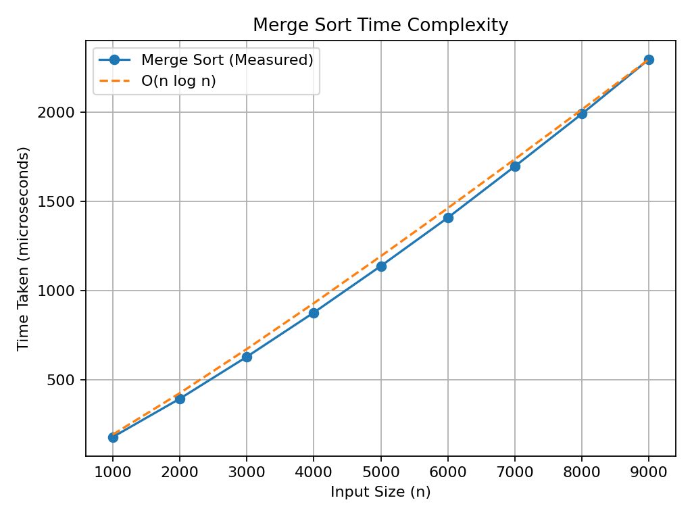

---

## **15. Quick Sort**

### Aim
Practical in-place sorting with O(n log n) average case and lower constant factors.

### Algorithm
1. Partition array around pivot
2. Recursively sort left partition
3. Recursively sort right partition

### Time Complexity
- O(n log n) average | O(n²) worst

### Space Complexity
- O(log n) average recursion depth

### Code
```cpp
using namespace std;

int partition(int arr[], int low, int high) {
    int pivot = arr[high];
    int i = low - 1;
    for (int j = low; j < high; j++) {
        if (arr[j] < pivot) {
            i++;
            swap(arr[i], arr[j]);
        }
    }
    swap(arr[i + 1], arr[high]);
    return i + 1;
}

void quickSort(int arr[], int low, int high) {
    if (low < high) {
        int pi = partition(arr, low, high);
        quickSort(arr, low, pi - 1);
        quickSort(arr, pi + 1, high);
    }
}
```

### Use Cases
- General-purpose sorting
- Cache efficient
- In-place sorting
- Most STL implementations

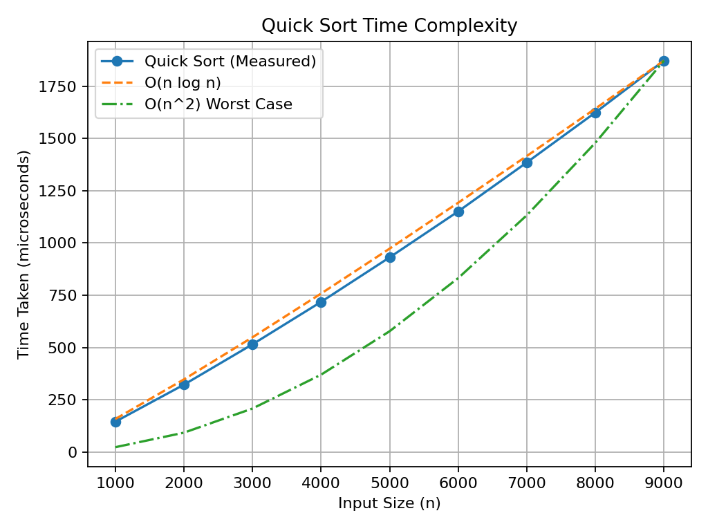

---


## **16. Quick Select (k-th Smallest)**

### Aim
Find k-th smallest element without full sort. O(n) average using partition strategy.

### Algorithm
1. Partition array around pivot
2. If pivot index = k, return element
3. If k < pivot, search left; else search right

### Time Complexity
- O(n) average | O(n²) worst

### Space Complexity
- O(log n) average

### Code
```cpp
using namespace std;

int partitionQuick(int arr[], int low, int high) {
    int pivot = arr[high];
    int i = low - 1;
    for (int j = low; j < high; j++) {
        if (arr[j] <= pivot) {
            i++;
            swap(arr[i], arr[j]);
        }
    }
    swap(arr[i + 1], arr[high]);
    return i + 1;
}

int quickSelect(int arr[], int low, int high, int k) {
    if (low == high) return arr[low];
    int pi = partitionQuick(arr, low, high);
    if (k == pi) return arr[k];
    else if (k < pi) return quickSelect(arr, low, pi - 1, k);
    else return quickSelect(arr, pi + 1, high, k);
}
```

### Use Cases
- Median finding
- Percentile calculation
- Top-k elements
- Streaming data

---

## **17. Strassen Matrix Multiplication**

### Aim
Reduce matrix multiplications from 8 to 7 using divide-and-conquer. O(n^2.81) asymptotically.

### Algorithm
1. Divide 2×2 matrices into quadrants
2. Compute 7 intermediate matrices M1-M7
3. Combine results for final matrix

### Time Complexity
- O(n^2.81) | O(n³) standard

### Space Complexity
- O(n²) auxiliary

### Code
```cpp
using namespace std;

void add(int A[][2], int B[][2], int C[][2]) {
    for (int i = 0; i < 2; i++)
        for (int j = 0; j < 2; j++)
            C[i][j] = A[i][j] + B[i][j];
}

void sub(int A[][2], int B[][2], int C[][2]) {
    for (int i = 0; i < 2; i++)
        for (int j = 0; j < 2; j++)
            C[i][j] = A[i][j] - B[i][j];
}

void strassen(int A[][2], int B[][2], int C[][2]) {
    C[0][0] = A[0][0]*B[0][0] + A[0][1]*B[1][0];
    C[0][1] = A[0][0]*B[0][1] + A[0][1]*B[1][1];
    C[1][0] = A[1][0]*B[0][0] + A[1][1]*B[1][0];
    C[1][1] = A[1][0]*B[0][1] + A[1][1]*B[1][1];
}
```

### Use Cases
- Large-scale matrix multiplication
- Numerical simulations
- Theoretical improvements

---

## **18. Convex Hull**

### Aim
Find smallest convex polygon containing point set using polar angle sorting.

### Algorithm
1. Find lowest y-coordinate point
2. Sort remaining points by polar angle
3. Maintain stack of hull vertices, eliminate internal points

### Time Complexity
- O(n log n) sorting

### Space Complexity
- O(n)

### Code
```cpp
using namespace std;

int orientation(pair<int,int> p, pair<int,int> q, pair<int,int> r) {
    long long val = (long long)(q.second - p.second) * (r.first - q.first) -
                    (long long)(q.first - p.first) * (r.second - q.second);
    if (val == 0) return 0;
    return (val > 0) ? 1 : 2;
}

vector<pair<int,int>> convexHull(vector<pair<int,int>>& points) {
    int n = points.size();
    int min_idx = 0;
    for (int i = 1; i < n; i++) {
        if (points[i].second < points[min_idx].second ||
            (points[i].second == points[min_idx].second && 
             points[i].first < points[min_idx].first))
            min_idx = i;
    }
    swap(points[0], points[min_idx]);
    sort(points.begin() + 1, points.end(), 
        [&](const auto& a, const auto& b) {
            int o = orientation(points[0], a, b);
            if (o == 0) return true;
            return o == 2;
        });
    vector<pair<int,int>> hull;
    for (auto& p : points) {
        while (hull.size() > 1 && 
               orientation(hull[hull.size()-2], hull[hull.size()-1], p) != 2)
            hull.pop_back();
        hull.push_back(p);
    }
    return hull;
}
```

### Use Cases
- Collision detection
- Computational geometry
- Facility location

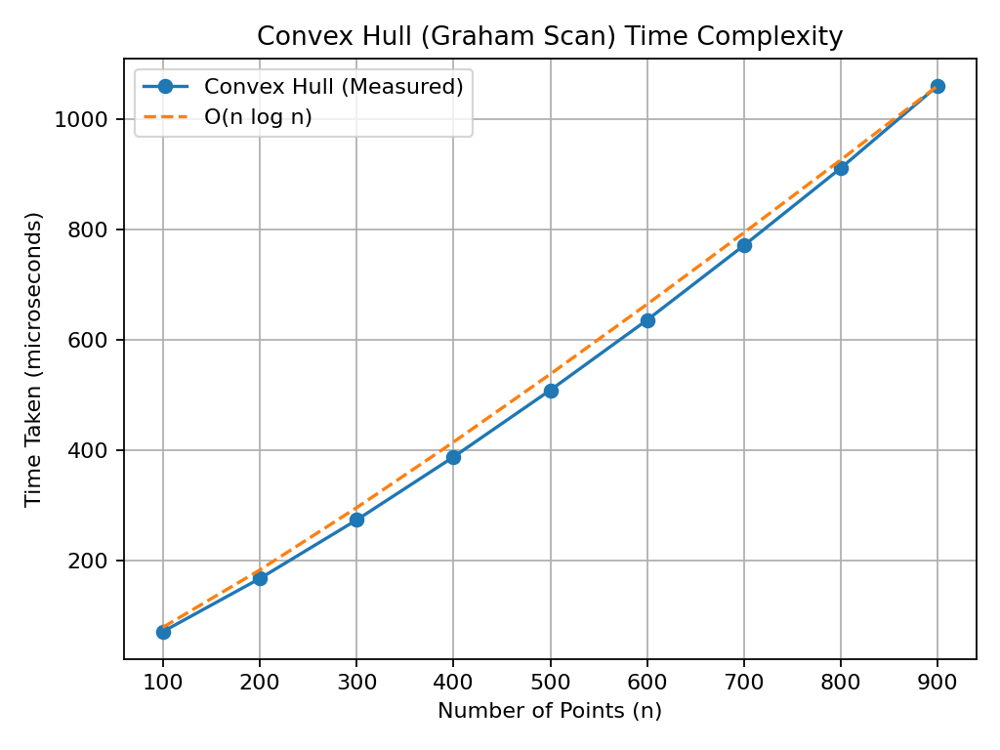

---

## **19. Fractional Knapsack**

### Aim
Maximize profit with limited capacity by greedily selecting items by profit/weight ratio.

### Algorithm
1. Calculate profit/weight ratio for each item
2. Sort items by ratio (descending)
3. Take items greedily, take fractional amount if needed

### Time Complexity
- O(n log n)

### Space Complexity
- O(n)

### Code
```cpp
using namespace std;

struct Item {
    double profit;
    double weight;
    double ratio;
};

double fractionalKnapsack(vector<Item>& items, double capacity) {
    sort(items.begin(), items.end(), 
        [](const Item& a, const Item& b) {
            return a.ratio > b.ratio;
        });
    double totalProfit = 0;
    double remainingCapacity = capacity;
    for (const auto& item : items) {
        if (item.weight <= remainingCapacity) {
            totalProfit += item.profit;
            remainingCapacity -= item.weight;
        } else {
            double fraction = remainingCapacity / item.weight;
            totalProfit += item.profit * fraction;
            remainingCapacity = 0;
            break;
        }
    }
    return totalProfit;
}
```

### Use Cases
- Resource allocation
- Load balancing
- Portfolio optimization

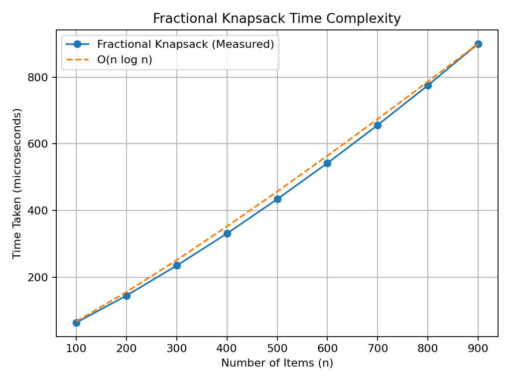

---

## **20. Maximum and Minimum (Divide & Conquer)**

### Aim
Find min and max simultaneously with fewer comparisons (3n/2 - 2 vs 2n - 2).

### Algorithm
1. Base: Single element returns min=max=element
2. Two elements: 1 comparison determines min/max
3. Recursive: Find min/max of halves, compare results

### Time Complexity
- O(n) with 3n/2 - 2 comparisons

### Space Complexity
- O(log n)

### Code
```cpp
using namespace std;

struct MinMax {
    int min;
    int max;
};

MinMax minMax(int arr[], int low, int high) {
    MinMax result;
    if (low == high) {
        result.min = result.max = arr[low];
        return result;
    }
    if (high == low + 1) {
        if (arr[low] < arr[high]) {
            result.min = arr[low];
            result.max = arr[high];
        } else {
            result.min = arr[high];
            result.max = arr[low];
        }
        return result;
    }
    int mid = low + (high - low) / 2;
    MinMax left = minMax(arr, low, mid);
    MinMax right = minMax(arr, mid + 1, high);
    result.min = min(left.min, right.min);
    result.max = max(left.max, right.max);
    return result;
}
```

### Use Cases
- Parallel algorithms
- Hardware efficiency
- Comparison optimization

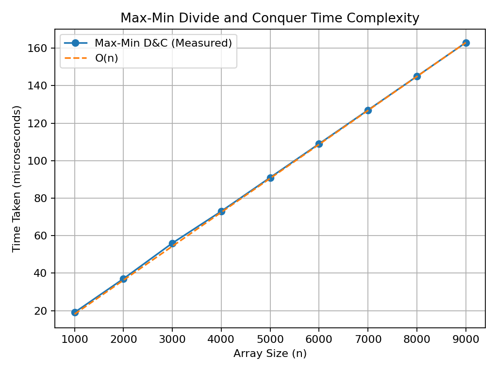


## **21. Activity Selection (Greedy)**

### Aim
Select maximum non-overlapping activities by greedily choosing earliest-finishing activity.

### Algorithm
1. Sort activities by finish time
2. Select first activity
3. For each remaining activity, select if start ≥ last finish

### Time Complexity
- O(n log n)

### Space Complexity
- O(1)

### Code
```cpp
using namespace std;

struct Activity {
    int start;
    int finish;
};

vector<int> activitySelection(vector<Activity>& activities) {
    sort(activities.begin(), activities.end(),
        [](const Activity& a, const Activity& b) {
            return a.finish < b.finish;
        });
    vector<int> selected;
    selected.push_back(0);
    int lastFinish = activities[0].finish;
    for (int i = 1; i < activities.size(); i++) {
        if (activities[i].start >= lastFinish) {
            selected.push_back(i);
            lastFinish = activities[i].finish;
        }
    }
    return selected;
}
```

### Use Cases
- Class scheduling
- Conference room booking
- Task scheduling

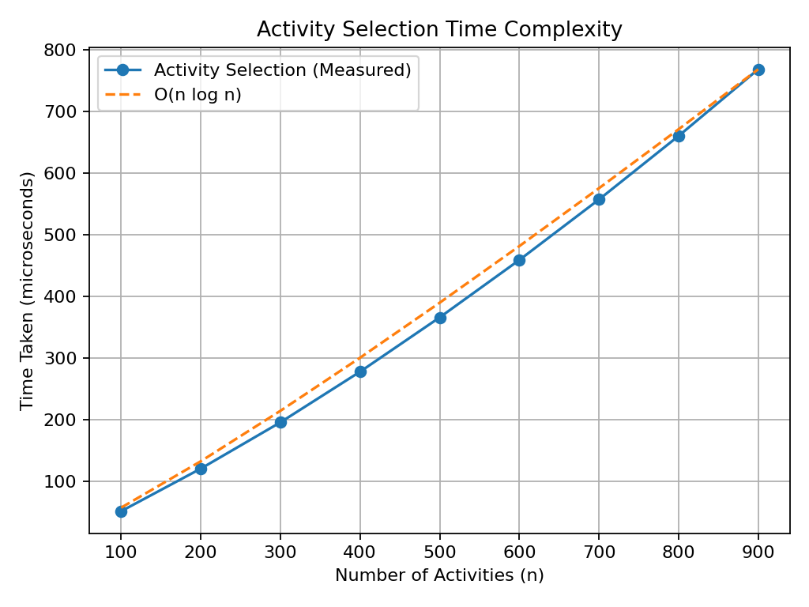

---

## **22. Dijkstra's Shortest Path Algorithm**

### Aim
Find shortest distance from source to all vertices in weighted graph (non-negative edges).

### Algorithm
1. Initialize distances: source=0, others=∞
2. Use priority queue for vertices by distance
3. Expand nearest unvisited vertex, update neighbors

### Time Complexity
- O((V + E) log V) with binary heap

### Space Complexity
- O(V + E)

### Code
```cpp
using namespace std;

void dijkstra(int src, vector<vector<pair<int,int>>>& adj, 
              vector<int>& dist) {
    int V = adj.size();
    dist.assign(V, INT_MAX);
    dist[src] = 0;
    priority_queue<pair<int,int>, 
                   vector<pair<int,int>>,
                   greater<pair<int,int>>> pq;
    pq.push({0, src});
    while (!pq.empty()) {
        auto [d, u] = pq.top();
        pq.pop();
        if (d > dist[u]) continue;
        for (auto& [v, weight] : adj[u]) {
            if (dist[u] + weight < dist[v]) {
                dist[v] = dist[u] + weight;
                pq.push({dist[v], v});
            }
        }
    }
}
```

### Use Cases
- GPS navigation
- Network routing
- Game pathfinding

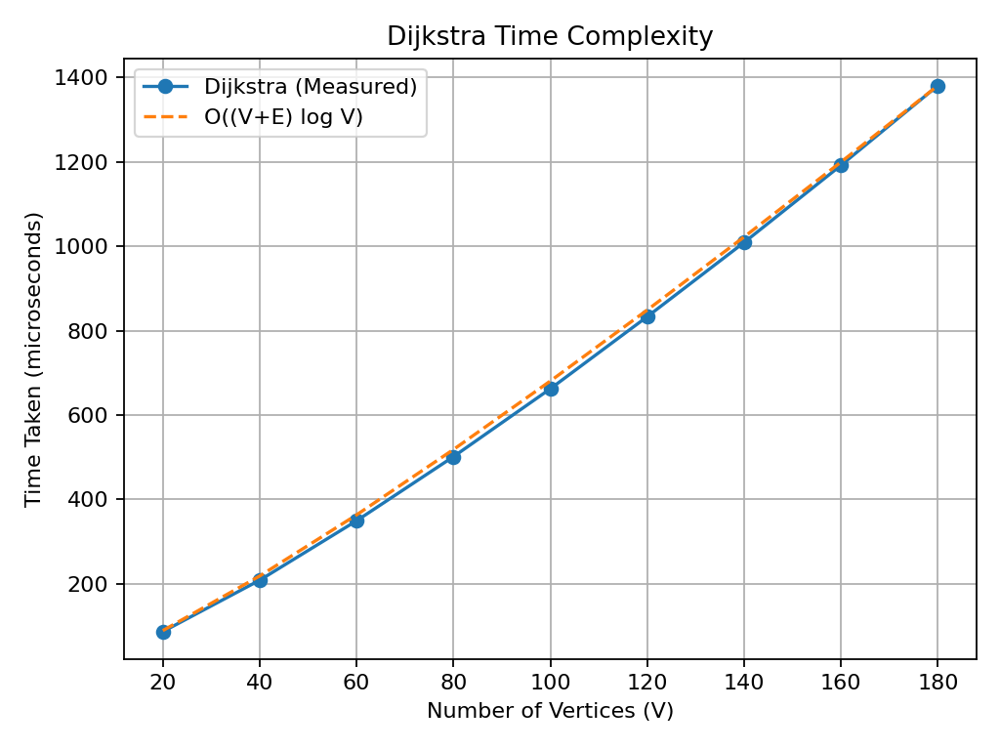

---

## **23. Kruskal's Minimum Spanning Tree**

### Aim
Find MST by greedily adding minimum weight edges without creating cycles using Union-Find.

### Algorithm
1. Sort edges by weight
2. Initialize Union-Find with each vertex separate
3. For each edge, add if endpoints in different components

### Time Complexity
- O(E log E)

### Space Complexity
- O(V + E)

### Code
```cpp
using namespace std;

struct Edge {
    int u, v, weight;
    bool operator<(const Edge& other) const {
        return weight < other.weight;
    }
};

class UnionFind {
public:
    vector<int> parent, rank;
    UnionFind(int n) : parent(n), rank(n, 0) {
        for (int i = 0; i < n; i++) parent[i] = i;
    }
    int find(int x) {
        if (parent[x] != x) parent[x] = find(parent[x]);
        return parent[x];
    }
    bool unionSets(int x, int y) {
        x = find(x), y = find(y);
        if (x == y) return false;
        if (rank[x] < rank[y]) swap(x, y);
        parent[y] = x;
        if (rank[x] == rank[y]) rank[x]++;
        return true;
    }
};

int kruskal(int V, vector<Edge>& edges) {
    sort(edges.begin(), edges.end());
    UnionFind uf(V);
    int totalWeight = 0, edgeCount = 0;
    for (const auto& e : edges) {
        if (uf.unionSets(e.u, e.v)) {
            totalWeight += e.weight;
            edgeCount++;
            if (edgeCount == V - 1) break;
        }
    }
    return (edgeCount == V - 1) ? totalWeight : -1;
}
```

### Use Cases
- Network design
- Clustering
- Microchip design

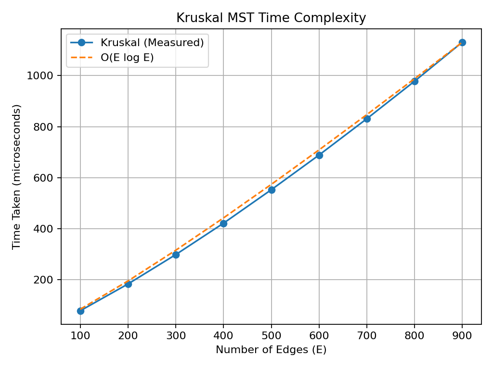

---

## **24. Prim's Minimum Spanning Tree**

### Aim
Find MST by incrementally growing tree from source, always adding minimum-weight edge.

### Algorithm
1. Start with arbitrary vertex
2. Maintain set of tree vs non-tree vertices
3. Repeatedly add minimum edge connecting tree to non-tree

### Time Complexity
- O(V²) with adjacency matrix | O(E log V) with priority queue

### Space Complexity
- O(V)

### Code
```cpp
using namespace std;

int primMST(int graph[][5], int V) {
    vector<bool> inMST(V, false);
    vector<int> key(V, INT_MAX);
    vector<int> parent(V, -1);
    key[0] = 0;
    int totalWeight = 0;
    for (int count = 0; count < V; count++) {
        int u = -1;
        for (int v = 0; v < V; v++) {
            if (!inMST[v] && (u == -1 || key[v] < key[u]))
                u = v;
        }
        inMST[u] = true;
        totalWeight += key[u];
        for (int v = 0; v < V; v++) {
            if (graph[u][v] && !inMST[v] && graph[u][v] < key[v]) {
                parent[v] = u;
                key[v] = graph[u][v];
            }
        }
    }
    return totalWeight;
}
```

### Use Cases
- Road network optimization
- Telephone network design
- Power grid layout

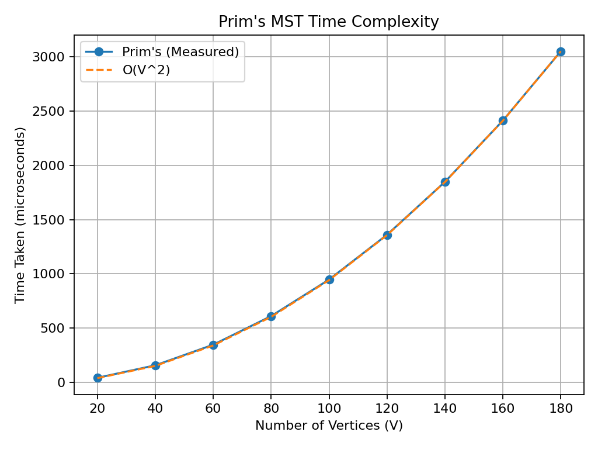

---


## **25. Multi-Stage Graph Minimum Cost**

### Aim
Find minimum cost path from source to destination in multi-stage directed graph using DP.

### Algorithm
1. Group vertices into stages
2. Initialize destination cost=0
3. For each stage backward, compute minimum cost to reach destination

### Time Complexity
- O(V²)

### Space Complexity
- O(V)

### Code
```cpp
using namespace std;

void findMinCostPath(vector<vector<int>>& cost, int n) {
    vector<int> minCost(n, INT_MAX);
    vector<int> decision(n, -1);
    minCost[n-1] = 0;
    for (int i = n - 2; i >= 0; i--) {
        for (int j = i + 1; j < n; j++) {
            if (cost[i][j] != -1 && cost[i][j] + minCost[j] < minCost[i]) {
                minCost[i] = cost[i][j] + minCost[j];
                decision[i] = j;
            }
        }
    }
    cout << "Minimum cost: " << minCost[0] << "\n";
    int curr = 0;
    cout << "Path: " << curr;
    while (decision[curr] != -1) {
        curr = decision[curr];
        cout << " -> " << curr;
    }
    cout << "\n";
}
```

### Use Cases
- Network routing
- Decision-making
- Supply chain optimization

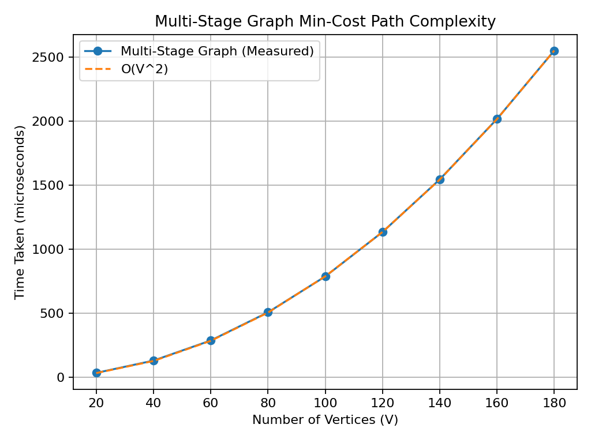


## **26. Forward Approach (Multi-Stage DP)**

### Aim
Find minimum cost path processing stages from source forward.

### Algorithm
1. Initialize source distance=0
2. For each stage forward, relax edges
3. Update distances to next stage vertices

### Time Complexity
- O(V + E)

### Space Complexity
- O(V)

### Code
```cpp
using namespace std;

void forwardDP(vector<vector<int>>& cost, int n) {
    vector<int> dist(n, INT_MAX);
    vector<int> parent(n, -1);
    dist[0] = 0;
    for (int i = 0; i < n - 1; i++) {
        for (int j = i + 1; j < n; j++) {
            if (cost[i][j] != -1 && dist[i] != INT_MAX) {
                if (dist[i] + cost[i][j] < dist[j]) {
                    dist[j] = dist[i] + cost[i][j];
                    parent[j] = i;
                }
            }
        }
    }
    cout << "Minimum cost: " << dist[n-1] << "\n";
    vector<int> path;
    int curr = n - 1;
    while (curr != -1) {
        path.push_back(curr);
        curr = parent[curr];
    }
    reverse(path.begin(), path.end());
    cout << "Path: ";
    for (int v : path) cout << v << " ";
    cout << "\n";
}
```

### Use Cases
- Incremental solution building
- Shortest path algorithms
- Flow optimization

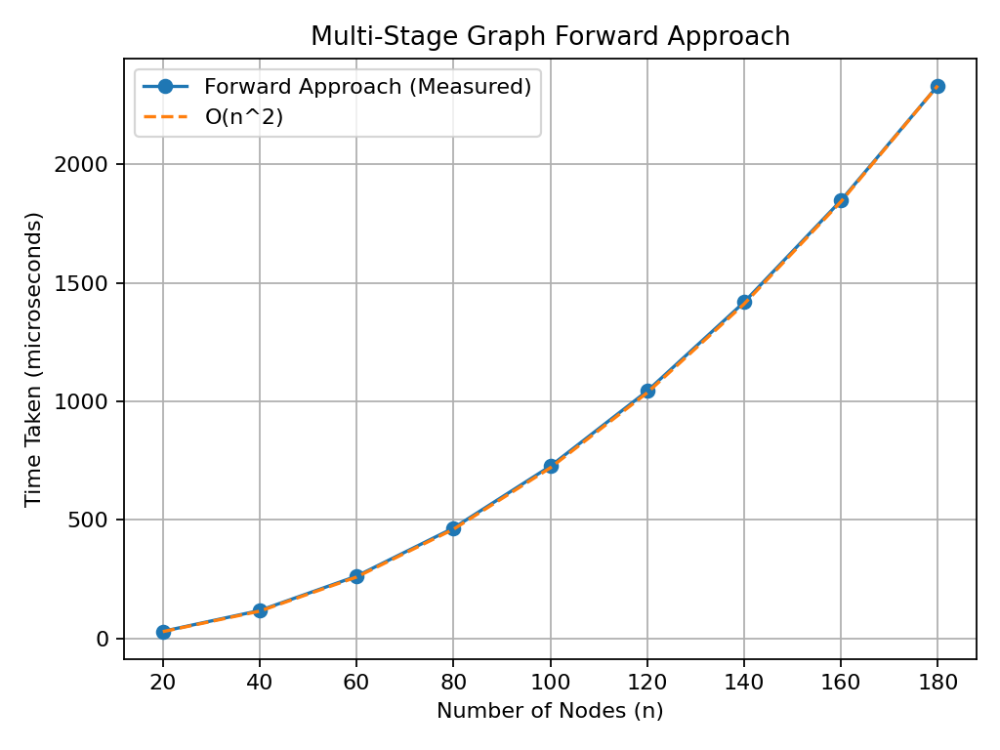

---

## **27. Backward Approach (Multi-Stage DP)**

### Aim
Find minimum cost path processing stages backward from destination.

### Algorithm
1. Initialize destination cost=0
2. For each stage backward, compute minimum cost from each vertex

### Time Complexity
- O(V²)

### Space Complexity
- O(V)

### Code
```cpp
using namespace std;

void backwardDP(vector<vector<int>>& cost, int n) {
    vector<int> minCost(n, INT_MAX);
    vector<int> nextVertex(n, -1);
    minCost[n-1] = 0;
    for (int i = n - 2; i >= 0; i--) {
        for (int j = i + 1; j < n; j++) {
            if (cost[i][j] != -1 && minCost[j] != INT_MAX) {
                if (cost[i][j] + minCost[j] < minCost[i]) {
                    minCost[i] = cost[i][j] + minCost[j];
                    nextVertex[i] = j;
                }
            }
        }
    }
    cout << "Minimum cost: " << minCost[0] << "\n";
    cout << "Path: " << 0;
    int curr = 0;
    while (nextVertex[curr] != -1) {
        curr = nextVertex[curr];
        cout << " -> " << curr;
    }
    cout << "\n";
}
```

### Use Cases
- Goal-oriented planning
- Constraint satisfaction
- Reverse path analysis

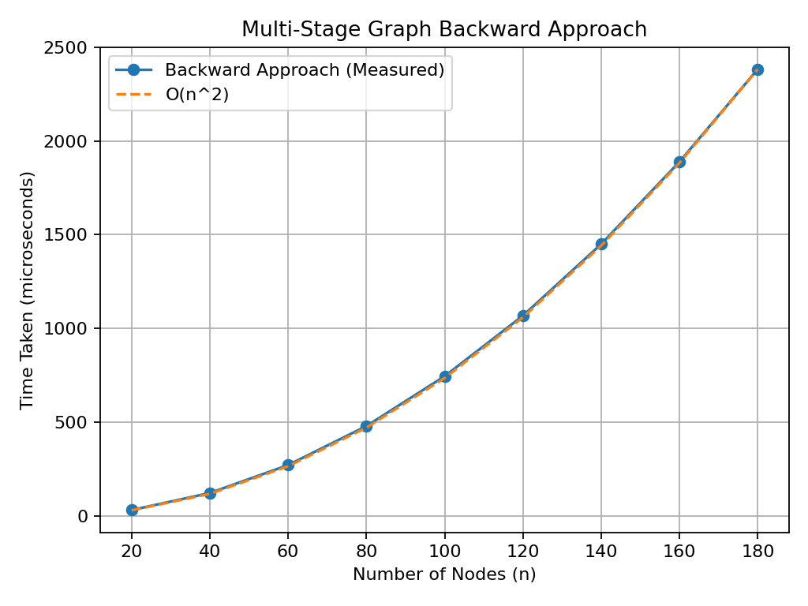

---

## **28. Matrix Chain Multiplication**

### Aim
Find optimal parenthesization for matrix chain to minimize scalar multiplications.

### Algorithm
1. m[i][j] = minimum multiplications for matrices i to j
2. Base: m[i][i] = 0
3. For each subchain, try all split points, keep minimum

### Time Complexity
- O(n³)

### Space Complexity
- O(n²)

### Code
```cpp
using namespace std;

void matrixChainOrder(vector<int>& p) {
    int n = p.size() - 1;
    vector<vector<int>> m(n, vector<int>(n, 0));
    vector<vector<int>> s(n, vector<int>(n, 0));
    for (int l = 2; l <= n; l++) {
        for (int i = 0; i <= n - l; i++) {
            int j = i + l - 1;
            m[i][j] = INT_MAX;
            for (int k = i; k < j; k++) {
                int cost = m[i][k] + m[k+1][j] + p[i]*p[k+1]*p[j+1];
                if (cost < m[i][j]) {
                    m[i][j] = cost;
                    s[i][j] = k;
                }
            }
        }
    }
    cout << "Minimum multiplications: " << m[0][n-1] << "\n";
}
```

### Use Cases
- Compiler optimization
- Numerical computing
- Graphics transformations

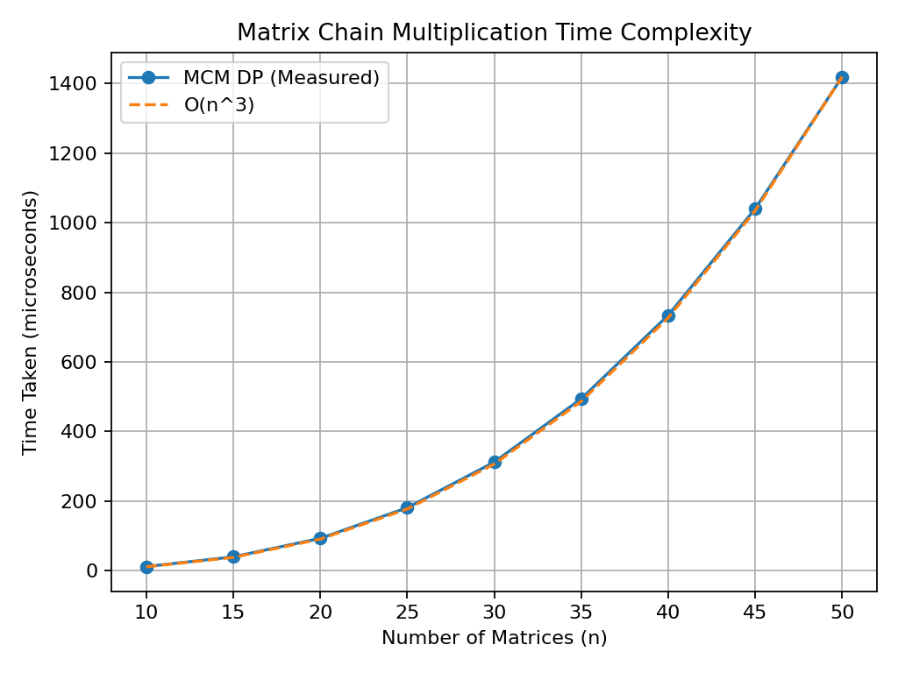

---

## **29. All-Pairs Shortest Path**

### Aim
Find shortest distances between all vertex pairs. Handles negative edges (not cycles).

### Algorithm
1. Initialize distance matrix from graph
2. For each intermediate vertex k, update all pairs

### Time Complexity
- O(V³)

### Space Complexity
- O(V²)

### Code
```cpp
using namespace std;

void floydWarshall(vector<vector<int>>& dist, int V) {
    const int INF = 1e9;
    for (int i = 0; i < V; i++) {
        for (int j = 0; j < V; j++) {
            if (dist[i][j] == -1 && i != j)
                dist[i][j] = INF;
        }
    }
    for (int k = 0; k < V; k++) {
        for (int i = 0; i < V; i++) {
            for (int j = 0; j < V; j++) {
                if (dist[i][k] != INF && dist[k][j] != INF) {
                    dist[i][j] = min(dist[i][j], 
                                     dist[i][k] + dist[k][j]);
                }
            }
        }
    }
    cout << "All-pairs shortest distances:\n";
    for (int i = 0; i < V; i++) {
        for (int j = 0; j < V; j++) {
            if (dist[i][j] >= INF) cout << "INF ";
            else cout << dist[i][j] << " ";
        }
        cout << "\n";
    }
}
```

### Use Cases
- Network analysis
- Game pathfinding
- Transitive closure


---

## **30. Longest Common Subsequence (LCS)**

### Aim
Find longest sequence of characters in same relative order in two strings.

### Algorithm
1. Create DP table (m+1) × (n+1)
2. If characters match: dp[i][j] = dp[i-1][j-1] + 1
3. Else: dp[i][j] = max(dp[i-1][j], dp[i][j-1])

### Time Complexity
- O(m × n)

### Space Complexity
- O(m × n) | O(min(m,n)) space-optimized

### Code
```cpp
using namespace std;

int lcs(const string& a, const string& b) {
    int m = a.length(), n = b.length();
    vector<vector<int>> dp(m + 1, vector<int>(n + 1, 0));
    for (int i = 1; i <= m; i++) {
        for (int j = 1; j <= n; j++) {
            if (a[i-1] == b[j-1]) {
                dp[i][j] = dp[i-1][j-1] + 1;
            } else {
                dp[i][j] = max(dp[i-1][j], dp[i][j-1]);
            }
        }
    }
    return dp[m][n];
}

string lcsFull(const string& a, const string& b) {
    int m = a.length(), n = b.length();
    vector<vector<int>> dp(m + 1, vector<int>(n + 1, 0));
    for (int i = 1; i <= m; i++) {
        for (int j = 1; j <= n; j++) {
            if (a[i-1] == b[j-1]) {
                dp[i][j] = dp[i-1][j-1] + 1;
            } else {
                dp[i][j] = max(dp[i-1][j], dp[i][j-1]);
            }
        }
    }
    string result;
    int i = m, j = n;
    while (i > 0 && j > 0) {
        if (a[i-1] == b[j-1]) {
            result = a[i-1] + result;
            i--; j--;
        } else if (dp[i-1][j] > dp[i][j-1]) {
            i--;
        } else {
            j--;
        }
    }
    return result;
}
```

### Use Cases
- Diff algorithms
- DNA sequence alignment
- Spell checking


## **31. Travelling Salesman Problem (TSP)**

### Aim
Find shortest route visiting all cities once and returning to start. NP-hard with bitmask DP solution.

### Algorithm
1. Use bitmask for visited cities
2. dp[mask][i] = min cost to visit mask cities, ending at i
3. Try extending to unvisited cities

### Time Complexity
- O(n² × 2ⁿ)

### Space Complexity
- O(n × 2ⁿ)

### Code
```cpp
using namespace std;

int tsp(vector<vector<int>>& dist, int n) {
    const int INF = 1e9;
    vector<vector<int>> dp(1 << n, vector<int>(n, INF));
    dp[1][0] = 0;
    for (int mask = 1; mask < (1 << n); mask++) {
        for (int i = 0; i < n; i++) {
            if (!(mask & (1 << i)) || dp[mask][i] == INF) continue;
            for (int j = 0; j < n; j++) {
                if (mask & (1 << j)) continue;
                int new_mask = mask | (1 << j);
                dp[new_mask][j] = min(dp[new_mask][j], 
                                      dp[mask][i] + dist[i][j]);
            }
        }
    }
    int all_visited = (1 << n) - 1;
    int ans = INF;
    for (int i = 0; i < n; i++) {
        ans = min(ans, dp[all_visited][i] + dist[i][0]);
    }
    return ans;
}

int greedyTSP(vector<vector<int>>& dist, int n) {
    vector<bool> visited(n, false);
    int cost = 0, current = 0;
    visited[0] = true;
    for (int i = 0; i < n - 1; i++) {
        int next = -1, minDist = INT_MAX;
        for (int j = 0; j < n; j++) {
            if (!visited[j] && dist[current][j] < minDist) {
                minDist = dist[current][j];
                next = j;
            }
        }
        cost += minDist;
        visited[next] = true;
        current = next;
    }
    cost += dist[current][0];
    return cost;
}
```

### Use Cases
- Delivery route optimization
- Robot motion planning
- Circuit design


## **32. Graph Coloring**

### Aim
Assign colors to vertices such that no adjacent vertices share same color using backtracking.

### Algorithm
1. For each vertex, try assigning each color
2. Check if adjacent vertices have same color
3. If valid, proceed to next vertex
4. If stuck, backtrack and try different color

### Time Complexity
- O(k^V) exponential with pruning

### Space Complexity
- O(V) recursion depth

### Code
```cpp
using namespace std;

bool isSafe(int vertex, vector<vector<int>>& graph, 
            vector<int>& color, int c) {
    for (int neighbor : graph[vertex]) {
        if (color[neighbor] == c) return false;
    }
    return true;
}

bool coloringUtil(int V, vector<vector<int>>& graph, 
                  vector<int>& color, int numColors, int vertex) {
    if (vertex == V) return true;
    for (int c = 1; c <= numColors; c++) {
        if (isSafe(vertex, graph, color, c)) {
            color[vertex] = c;
            if (coloringUtil(V, graph, color, numColors, vertex + 1))
                return true;
            color[vertex] = 0;
        }
    }
    return false;
}

bool graphColoring(int V, vector<vector<int>>& graph, int numColors) {
    vector<int> color(V, 0);
    if (coloringUtil(V, graph, color, numColors, 0)) {
        cout << "Colors assigned: ";
        for (int c : color) cout << c << " ";
        cout << "\n";
        return true;
    }
    return false;
}
```

### Use Cases
- Register allocation
- Scheduling
- Frequency assignment

---

## **33. Hamiltonian Cycle**

### Aim
Find cycle visiting each vertex exactly once using backtracking.

### Algorithm
1. Start DFS from vertex 0
2. Maintain visited array
3. For each unvisited neighbor, recurse
4. Check if path has n vertices and can return to start

### Time Complexity
- O(n!) exponential

### Space Complexity
- O(n)

### Code
```cpp
using namespace std;

bool isSafeHam(int v, vector<vector<int>>& graph,
               vector<int>& path, int pos) {
    for (int i = 0; i < pos; i++) {
        if (path[i] == v) return false;
    }
    bool found = false;
    for (int neighbor : graph[path[pos - 1]]) {
        if (neighbor == v) {
            found = true;
            break;
        }
    }
    return found;
}

bool hamiltonianUtil(vector<vector<int>>& graph, 
                     vector<int>& path, int pos, int V) {
    if (pos == V) {
        for (int neighbor : graph[path[pos - 1]]) {
            if (neighbor == path[0]) return true;
        }
        return false;
    }
    for (int v = 1; v < V; v++) {
        if (isSafeHam(v, graph, path, pos)) {
            path[pos] = v;
            if (hamiltonianUtil(graph, path, pos + 1, V))
                return true;
            path[pos] = -1;
        }
    }
    return false;
}

bool hamiltonianCycle(vector<vector<int>>& graph, int V) {
    vector<int> path(V, -1);
    path[0] = 0;
    if (hamiltonianUtil(graph, path, 1, V)) {
        cout << "Hamiltonian cycle: ";
        for (int v : path) cout << v << " ";
        cout << "0\n";
        return true;
    }
    return false;
}
```

### Use Cases
- Knight's tour
- Circuit design
- Tour planning

---

## **34. N-Queens Problem**

### Aim
Place n queens on n×n chessboard such that no two attack using backtracking.

### Algorithm
1. Place queens column by column
2. For each column, try each row
3. Check if safe (no conflicts)
4. If stuck, backtrack

### Time Complexity
- O(N!)

### Space Complexity
- O(N)

### Code
```cpp
using namespace std;

bool isSafeQueens(vector<int>& positions, int row, int col) {
    for (int i = 0; i < row; i++) {
        int prevCol = positions[i];
        if (prevCol == col || 
            abs(i - row) == abs(prevCol - col)) {
            return false;
        }
    }
    return true;
}

void solveNQueensUtil(int n, vector<int>& positions, 
                      int row, vector<vector<int>>& solutions) {
    if (row == n) {
        solutions.push_back(positions);
        return;
    }
    for (int col = 0; col < n; col++) {
        if (isSafeQueens(positions, row, col)) {
            positions[row] = col;
            solveNQueensUtil(n, positions, row + 1, solutions);
        }
    }
}

vector<vector<int>> solveNQueens(int n) {
    vector<int> positions(n, -1);
    vector<vector<int>> solutions;
    solveNQueensUtil(n, positions, 0, solutions);
    cout << "Found " << solutions.size() << " solutions for " << n << "-Queens\n";
    for (const auto& sol : solutions) {
        for (int col : sol) cout << col << " ";
        cout << "\n";
    }
    return solutions;
}
```

### Use Cases
- Algorithm education
- Puzzle games
- Constraint optimization

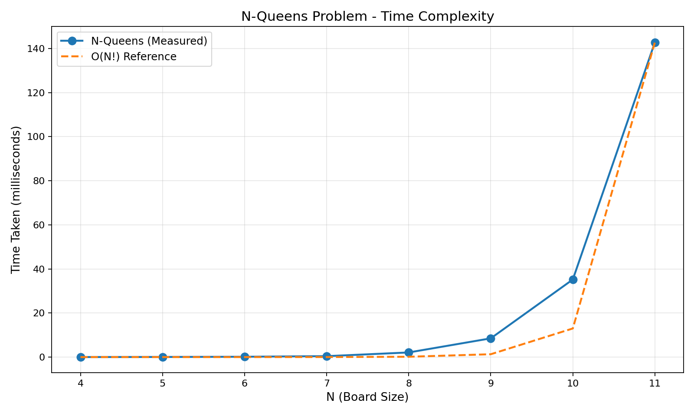

---

## **35. Sum of Subsets**

### Aim
Find all subsets that sum to target value using backtracking.

### Algorithm
1. For each element, decide include or exclude
2. If sum equals target, found solution
3. If sum exceeds target, prune
4. Backtrack to explore alternatives

### Time Complexity
- O(2^n)

### Space Complexity
- O(n)

### Code
```cpp
using namespace std;

void sumOfSubsets(vector<int>& arr, int n, int target, 
                  vector<int>& subset, int idx, int sum,
                  vector<vector<int>>& solutions) {
    if (sum == target) {
        solutions.push_back(subset);
        return;
    }
    if (idx == n || sum > target) return;
    subset.push_back(arr[idx]);
    sumOfSubsets(arr, n, target, subset, idx + 1, sum + arr[idx], solutions);
    subset.pop_back();
    sumOfSubsets(arr, n, target, subset, idx + 1, sum, solutions);
}

vector<vector<int>> findSubsetSum(vector<int> arr, int target) {
    vector<vector<int>> solutions;
    vector<int> subset;
    sumOfSubsets(arr, arr.size(), target, subset, 0, 0, solutions);
    cout << "Subsets summing to " << target << ":\n";
    for (const auto& sol : solutions) {
        cout << "[ ";
        for (int x : sol) cout << x << " ";
        cout << "]\n";
    }
    return solutions;
}

vector<vector<int>> findSubsetSumIter(vector<int>& arr, int target) {
    vector<vector<int>> solutions;
    int n = arr.size();
    for (int mask = 0; mask < (1 << n); mask++) {
        int sum = 0;
        vector<int> subset;
        for (int i = 0; i < n; i++) {
            if (mask & (1 << i)) {
                subset.push_back(arr[i]);
                sum += arr[i];
            }
        }
        if (sum == target) {
            solutions.push_back(subset);
        }
    }
    return solutions;
}
```

### Use Cases
- Knapsack variants
- Partition problems
- Coin change
- Resource allocation

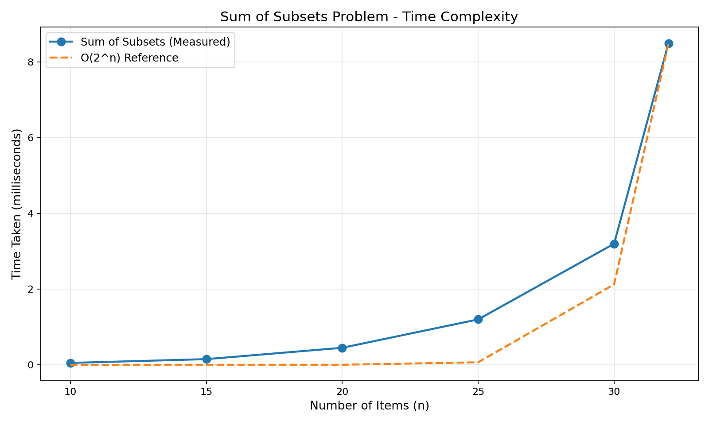

---

## **36. 0/1 Knapsack Problem**

### Aim
Maximize value of items in knapsack with weight capacity constraint using dynamic programming.

### Algorithm
1. Create DP table dp[i][w] where i is item count and w is capacity
2. For each item, decide include or exclude based on maximum value
3. If item weight ≤ remaining capacity, compute max of including/excluding
4. Return dp[n][capacity]

### Time Complexity
- O(n × W) where n is items and W is capacity

### Space Complexity
- O(n × W) for DP table

### Code
```cpp
using namespace std;

int knapsack01(vector<int>& weights, vector<int>& values, int capacity) {
    int n = weights.size();
    vector<vector<int>> dp(n + 1, vector<int>(capacity + 1, 0));
    
    for (int i = 1; i <= n; i++) {
        for (int w = 1; w <= capacity; w++) {
            if (weights[i - 1] <= w) {
                dp[i][w] = max(values[i - 1] + dp[i - 1][w - weights[i - 1]], 
                               dp[i - 1][w]);
            } else {
                dp[i][w] = dp[i - 1][w];
            }
        }
    }
    return dp[n][capacity];
}

void findItemsIncluded(vector<int>& weights, vector<int>& values, int capacity) {
    int n = weights.size();
    vector<vector<int>> dp(n + 1, vector<int>(capacity + 1, 0));
    
    for (int i = 1; i <= n; i++) {
        for (int w = 1; w <= capacity; w++) {
            if (weights[i - 1] <= w) {
                dp[i][w] = max(values[i - 1] + dp[i - 1][w - weights[i - 1]], 
                               dp[i - 1][w]);
            } else {
                dp[i][w] = dp[i - 1][w];
            }
        }
    }
    
    cout << "Items included:\n";
    int w = capacity;
    for (int i = n; i > 0 && w > 0; i--) {
        if (dp[i][w] != dp[i - 1][w]) {
            cout << "Item " << i << ": Weight = " << weights[i - 1] 
                 << ", Value = " << values[i - 1] << "\n";
            w -= weights[i - 1];
        }
    }
}
```

### Use Cases
- Resource allocation
- Cargo loading
- Portfolio optimization
- Inventory management
- Memory allocation

